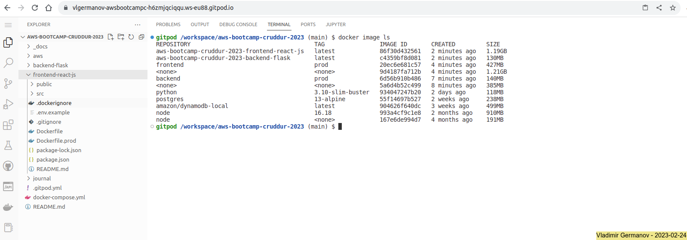
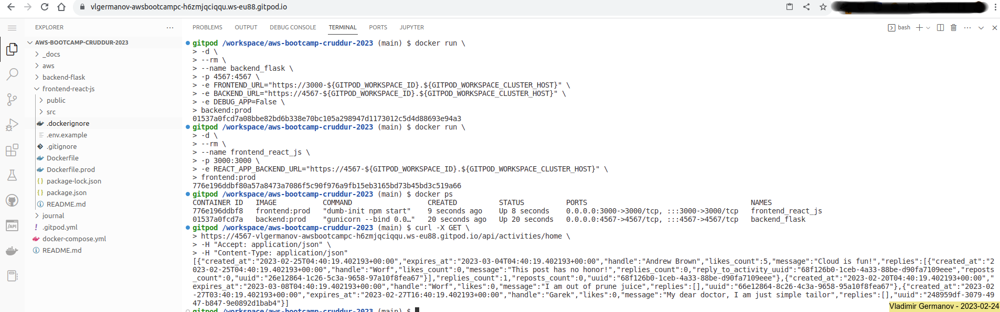
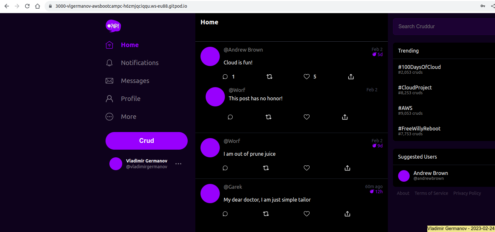

# Week 1 — App Containerization

## 1. Required Homework

### 1.1. Review of the week's videos

- [x] Watched: [How to Ask for Technical Help](https://www.youtube.com/watch?v=tDPqmwKMP7Y&list=PLBfufR7vyJJ7k25byhRXJldB5AiwgNnWv&index=29)
- [x] Watched: [Grading Homework Summaries](https://www.youtube.com/watch?v=FKAScachFgk&list=PLBfufR7vyJJ7k25byhRXJldB5AiwgNnWv&index=25)
- [x] Watched: [Week 1 - Live Streamed Video](https://www.youtube.com/watch?v=zJnNe5Nv4tE&list=PLBfufR7vyJJ7k25byhRXJldB5AiwgNnWv&index=22)
- [x] Watched: [Remember to Commit Your Code](https://www.youtube.com/watch?v=b-idMgFFcpg&list=PLBfufR7vyJJ7k25byhRXJldB5AiwgNnWv&index=23)
- [x] Watched: [Chirag's Week 1 - Spending Considerations](https://www.youtube.com/watch?v=OAMHu1NiYoI&list=PLBfufR7vyJJ7k25byhRXJldB5AiwgNnWv&index=24)
- [x] Watched: [Ashish's Week 1 - Container Security Considerations](https://www.youtube.com/watch?v=OjZz4D0B-cA&list=PLBfufR7vyJJ7k25byhRXJldB5AiwgNnWv&index=25)
- [x] Watched: [Containerize Application (Dockerfiles, Docker Compose)](https://www.youtube.com/watch?v=zJnNe5Nv4tE&list=PLBfufR7vyJJ7k25byhRXJldB5AiwgNnWv&index=22)
- [x] Watched: [Document the Notification Endpoint for the OpenAI Document](https://www.youtube.com/watch?v=k-_o0cCpksk&list=PLBfufR7vyJJ7k25byhRXJldB5AiwgNnWv&index=27)
> **Note:**
> [OpenAPI Specification v3.1.0](https://spec.openapis.org/oas/v3.1.0)
- [x] Watched: [Write a Flask Backend Endpoint for Notifications](https://www.youtube.com/watch?v=k-_o0cCpksk&list=PLBfufR7vyJJ7k25byhRXJldB5AiwgNnWv&index=27)
- [x] Watched: [Write a React Page for Notifications](https://www.youtube.com/watch?v=k-_o0cCpksk&list=PLBfufR7vyJJ7k25byhRXJldB5AiwgNnWv&index=27) 
> **Note:**
> Registration's confirmation code `hardcoded` to '1234'
- [x] Watched: [Run DynamoDB Local Container and ensure it works](https://www.youtube.com/watch?v=CbQNMaa6zTg&list=PLBfufR7vyJJ7k25byhRXJldB5AiwgNnWv&index=28)
- [x] Watched: [Run Postgres Container and ensure it works](https://www.youtube.com/watch?v=CbQNMaa6zTg&list=PLBfufR7vyJJ7k25byhRXJldB5AiwgNnWv&index=28)

### 1.2. Containerize the applications

#### 1.2.1. Backend-flask

- Created a [Dockerfile](../backend-flask/Dockerfile)

```dockerfile
FROM python:3.10-slim-buster

WORKDIR /backend-flask

COPY requirements.txt requirements.txt
RUN pip3 install -r requirements.txt

COPY . .

ENV FLASK_ENV=development

EXPOSE 4567

CMD [ "python3", "-m" , "flask", "run", "--host=0.0.0.0", "--port=4567"]
```

- Test `docker build`

```shell
gitpod /workspace/aws-bootcamp-cruddur-2023/backend-flask (main) $ docker build -t backend-flask:test .
Sending build context to Docker daemon  33.79kB
Step 1/8 : FROM python:3.10-slim-buster
 ---> 934047247b20
Step 2/8 : WORKDIR /backend-flask
 ---> Running in db01081dadcc
Removing intermediate container db01081dadcc
 ---> 84c3ed779f2b
Step 3/8 : COPY requirements.txt requirements.txt
 ---> 420141812611
Step 4/8 : RUN pip3 install -r requirements.txt
 ---> Running in f644ece4d265
Collecting flask
  Downloading Flask-2.2.3-py3-none-any.whl (101 kB)
     ━━━━━━━━━━━━━━━━━━━━━━━━━━━━━━━━━━━━━━━ 101.8/101.8 kB 7.1 MB/s eta 0:00:00
Collecting flask-cors
  Downloading Flask_Cors-3.0.10-py2.py3-none-any.whl (14 kB)
Collecting Werkzeug>=2.2.2
  Downloading Werkzeug-2.2.3-py3-none-any.whl (233 kB)
     ━━━━━━━━━━━━━━━━━━━━━━━━━━━━━━━━━━━━━━ 233.6/233.6 kB 33.3 MB/s eta 0:00:00
Collecting Jinja2>=3.0
  Downloading Jinja2-3.1.2-py3-none-any.whl (133 kB)
     ━━━━━━━━━━━━━━━━━━━━━━━━━━━━━━━━━━━━━━ 133.1/133.1 kB 49.2 MB/s eta 0:00:00
Collecting click>=8.0
  Downloading click-8.1.3-py3-none-any.whl (96 kB)
     ━━━━━━━━━━━━━━━━━━━━━━━━━━━━━━━━━━━━━━━━ 96.6/96.6 kB 37.2 MB/s eta 0:00:00
Collecting itsdangerous>=2.0
  Downloading itsdangerous-2.1.2-py3-none-any.whl (15 kB)
Collecting Six
  Downloading six-1.16.0-py2.py3-none-any.whl (11 kB)
Collecting MarkupSafe>=2.0
  Downloading MarkupSafe-2.1.2-cp310-cp310-manylinux_2_17_x86_64.manylinux2014_x86_64.whl (25 kB)
Installing collected packages: Six, MarkupSafe, itsdangerous, click, Werkzeug, Jinja2, flask, flask-cors
Successfully installed Jinja2-3.1.2 MarkupSafe-2.1.2 Six-1.16.0 Werkzeug-2.2.3 click-8.1.3 flask-2.2.3 flask-cors-3.0.10 itsdangerous-2.1.2
WARNING: Running pip as the 'root' user can result in broken permissions and conflicting behaviour with the system package manager. It is recommended to use a virtual environment instead: https://pip.pypa.io/warnings/venv

[notice] A new release of pip available: 22.3.1 -> 23.0.1
[notice] To update, run: pip install --upgrade pip
Removing intermediate container f644ece4d265
 ---> af551f3164ca
Step 5/8 : COPY . .
 ---> ba7a4fb6d899
Step 6/8 : ENV FLASK_ENV=development
 ---> Running in 555d0da1d10f
Removing intermediate container 555d0da1d10f
 ---> 55b4d21213f9
Step 7/8 : EXPOSE 4567
 ---> Running in 00979636d271
Removing intermediate container 00979636d271
 ---> 088a9e47f6ae
Step 8/8 : CMD [ "python3", "-m" , "flask", "run", "--host=0.0.0.0", "--port=4567"]
 ---> Running in 21e7fcbc4e54
Removing intermediate container 21e7fcbc4e54
 ---> 2b2dee66d340
Successfully built 2b2dee66d340
Successfully tagged backend-flask:test
gitpod /workspace/aws-bootcamp-cruddur-2023/backend-flask (main) $ docker image ls
REPOSITORY      TAG                IMAGE ID       CREATED         SIZE
backend-flask   test               2b2dee66d340   4 seconds ago   129MB
python          3.10-slim-buster   934047247b20   20 hours ago    118MB
gitpod /workspace/aws-bootcamp-cruddur-2023/backend-flask (main) $ docker rmi backend-flask:test 
Untagged: backend-flask:test
Deleted: sha256:2b2dee66d340116d2be3be2b21b4e2a64be544393f156688c46a1572e75411f9
Deleted: sha256:088a9e47f6aea017edaaa6928f2634c4dc36460de18dbc20fb8274a27a396842
Deleted: sha256:55b4d21213f9ba5b5f9cd49f9ee031533b90925f7426f4114ae213c82ac3129e
Deleted: sha256:ba7a4fb6d899e7a69786a4bc9e1989c5af325ffb16ffd43c2ef249860101c130
Deleted: sha256:eb305886f1a16742ee92401c6a3f7efc816bd0d8cf3cc4b697ba9ae2cb9d0a92
Deleted: sha256:af551f3164ca23b620f150caf75e2a41d9f6977103286799ac21d06125f8b70d
Deleted: sha256:68681d7346b9d0debfc5ced1ba32ff7466a9752775ede623e3d91727c42cafeb
Deleted: sha256:4201418126111b2652d8ef216f455b204a834fa3f8edb0cc9f3d3e1a5d8cc42f
Deleted: sha256:9ad4f2cb5c082f0faba9f6ad23c10cb4321135ea672601542e1bd7d836cdb820
Deleted: sha256:84c3ed779f2b27eb568c10ef639cf0ede5f96369b976745d7314d01d160e8820
Deleted: sha256:37bbcdab0d7c28d203ad79a2d848fc87a38f843ef2e78e1f330fc554168c6281
```


#### 1.2.2. Frontend-react-js

- Created a [Dockerfile](../frontend-react-js/Dockerfile)

```dockerfile
FROM node:16.18

ENV PORT=3000

COPY . /frontend-react-js
WORKDIR /frontend-react-js

RUN npm install
EXPOSE ${PORT}
CMD ["npm", "start"]
```

- Test `docker build`

```shell
gitpod /workspace/aws-bootcamp-cruddur-2023/frontend-react-js (main) $ docker build -t frontend-react-js:test .
Sending build context to Docker daemon   1.51MB
Step 1/7 : FROM node:16.18
 ---> 993a4cf9c1e8
Step 2/7 : ENV PORT=3000
 ---> Running in 4476467b4b92
Removing intermediate container 4476467b4b92
 ---> 2d18ea64267a
Step 3/7 : COPY . /frontend-react-js
 ---> b53708c7ee54
Step 4/7 : WORKDIR /frontend-react-js
 ---> Running in 907e22a3354f
Removing intermediate container 907e22a3354f
 ---> 2eb2da7f4eb1
Step 5/7 : RUN npm install
 ---> Running in ced0c60237b9
npm WARN deprecated w3c-hr-time@1.0.2: Use your platform's native performance.now() and performance.timeOrigin.
npm WARN deprecated stable@0.1.8: Modern JS already guarantees Array#sort() is a stable sort, so this library is deprecated. See the compatibility table on MDN: https://developer.mozilla.org/en-US/docs/Web/JavaScript/Reference/Global_Objects/Array/sort#browser_compatibility
npm WARN deprecated svgo@1.3.2: This SVGO version is no longer supported. Upgrade to v2.x.x.

added 1471 packages, and audited 1472 packages in 17s

225 packages are looking for funding
  run `npm fund` for details

8 high severity vulnerabilities

To address issues that do not require attention, run:
  npm audit fix

To address all issues (including breaking changes), run:
  npm audit fix --force

Run `npm audit` for details.
npm notice 
npm notice New major version of npm available! 8.19.2 -> 9.5.1
npm notice Changelog: <https://github.com/npm/cli/releases/tag/v9.5.1>
npm notice Run `npm install -g npm@9.5.1` to update!
npm notice 
Removing intermediate container ced0c60237b9
 ---> 30f699aa9691
Step 6/7 : EXPOSE ${PORT}
 ---> Running in 734e975763e6
Removing intermediate container 734e975763e6
 ---> aa0d6276c77e
Step 7/7 : CMD ["npm", "start"]
 ---> Running in f10e94b815f9
Removing intermediate container f10e94b815f9
 ---> e7c53d2f47ff
Successfully built e7c53d2f47ff
Successfully tagged frontend-react-js:test
gitpod /workspace/aws-bootcamp-cruddur-2023/frontend-react-js (main) $ docker image ls
REPOSITORY          TAG       IMAGE ID       CREATED          SIZE
frontend-react-js   test      e7c53d2f47ff   35 seconds ago   1.19GB
node                16.18     993a4cf9c1e8   2 months ago     910MB
gitpod /workspace/aws-bootcamp-cruddur-2023/frontend-react-js (main) $ docker rmi frontend-react-js:test node:16.18 
Untagged: frontend-react-js:test
Deleted: sha256:e7c53d2f47ff4975777e6a215de063fa7a41d7a69d495041a1439c9779551dd2
Deleted: sha256:aa0d6276c77e01bd54fe4af4976f625b433e1a1f46799f06da46890b91b224fd
Deleted: sha256:30f699aa969166c5bdbad0fd3c3dc0707cba41ff8e1a31b8ed8b4c32b05d9d19
Deleted: sha256:1566f243ad64aac48d1426beac0df7d6d0c76ec2f0e5d19f04513a87e6879802
Deleted: sha256:2eb2da7f4eb15b55daef925dcc761ddd254255148a9f5d7588f972cd586dafd4
Deleted: sha256:b53708c7ee54f57762ef6e62435f9e1db367e00949946f338adb279ed97a9420
Deleted: sha256:ddefc03c829a8d8d6ac0f56af0879bd75b37846035c0236cc4429fcfd5e785b7
Deleted: sha256:2d18ea64267a38df7b3b8111ee7be46e436a218e62903621b34a054549054c4f
Untagged: node:16.18
Untagged: node@sha256:7f404d09ceb780c51f4fac7592c46b8f21211474aacce25389eb0df06aaa7472
Deleted: sha256:993a4cf9c1e80aa74567d3deea4dfa1488b94dcb024bfca9246f979845763509
Deleted: sha256:138a8239558b46fe6b960dcc9c40bdd108fe475b336d26c9bdc64a556989a2ac
Deleted: sha256:f21c65291da9a2e5d1333a6f9b65587c218fc766fd5c1e106165bd789fce72f8
Deleted: sha256:144e8cf2307d3547c00d0db36e55685deeb8574424773106eac5a9761977f017
Deleted: sha256:ac9975a42cd57dec25c63387428c6f46f16008062003ee67dad658c3cfa3d33a
Deleted: sha256:8ccfb73d7f0b7964f0687fe1d2862ef21ca78724bd470b4a52992d235409e484
Deleted: sha256:0108b6ee43459e7cc63f0857c157b3a100d5f844c50aa6cdaf97e5076e85a311
Deleted: sha256:a149f77f0d467a0aedf6bc5fe1e7514508df7e2f2108833801542ac143f7d140
Deleted: sha256:1c07cfa520c183a58e72eba5f438f7d00f8c50f97f55ca6ad1842e4649151e48
Deleted: sha256:3943af3b0cbde0bb8da4e4eb5e81efefe52669e9233eeff0ba820ac838121f65
```


#### 1.2.3. Docker-compose

- Created a [docker-compose.yml](../docker-compose.yml) file

```yaml
version: "3.8"

services:
  backend-flask:
    environment:
      FRONTEND_URL: "https://3000-${GITPOD_WORKSPACE_ID}.${GITPOD_WORKSPACE_CLUSTER_HOST}"
      BACKEND_URL: "https://4567-${GITPOD_WORKSPACE_ID}.${GITPOD_WORKSPACE_CLUSTER_HOST}"
    build: ./backend-flask
    ports:
      - "4567:4567"
    volumes:
      - ./backend-flask:/backend-flask

  frontend-react-js:
    environment:
      REACT_APP_BACKEND_URL: "https://4567-${GITPOD_WORKSPACE_ID}.${GITPOD_WORKSPACE_CLUSTER_HOST}"
    build: ./frontend-react-js
    ports:
      - "3000:3000"
    volumes:
      - ./frontend-react-js:/frontend-react-js

# the name flag is a hack to change the default prepend folder
# name when outputting the image names
networks: 
  internal-network:
    driver: bridge
    name: cruddur
```

- Tests


```shell
gitpod /workspace/aws-bootcamp-cruddur-2023 (main) $ curl -X GET https://4567-vlgermanov-awsbootcampc-hsq3j8x77fq.ws-eu88.gitpod.io/api/activities/home -H "Accept: application/json" -H "Content-Type: application/json"
[
  {
    "created_at": "2023-02-23T21:15:56.577144+00:00",
    "expires_at": "2023-03-02T21:15:56.577144+00:00",
    "handle": "Andrew Brown",
    "likes_count": 5,
    "message": "Cloud is fun!",
    "replies": [
      {
        "created_at": "2023-02-23T21:15:56.577144+00:00",
        "handle": "Worf",
        "likes_count": 0,
        "message": "This post has no honor!",
        "replies_count": 0,
        "reply_to_activity_uuid": "68f126b0-1ceb-4a33-88be-d90fa7109eee",
        "reposts_count": 0,
        "uuid": "26e12864-1c26-5c3a-9658-97a10f8fea67"
      }
    ],
    "replies_count": 1,
    "reposts_count": 0,
    "uuid": "68f126b0-1ceb-4a33-88be-d90fa7109eee"
  },
  {
    "created_at": "2023-02-18T21:15:56.577144+00:00",
    "expires_at": "2023-03-06T21:15:56.577144+00:00",
    "handle": "Worf",
    "likes": 0,
    "message": "I am out of prune juice",
    "replies": [],
    "uuid": "66e12864-8c26-4c3a-9658-95a10f8fea67"
  },
  {
    "created_at": "2023-02-25T20:15:56.577144+00:00",
    "expires_at": "2023-02-26T09:15:56.577144+00:00",
    "handle": "Garek",
    "likes": 0,
    "message": "My dear doctor, I am just simple tailor",
    "replies": [],
    "uuid": "248959df-3079-4947-b847-9e0892d1bab4"
  }
]
```

### 1.3. Notifications functionality in the applications

#### 1.3.1. Document the Notification Endpoint for the OpenAI Document

- Add the following to the `paths:` section in the [openapi-3.0.yml](../backend-flask/openapi-3.0.yml) file

```yaml
  /api/activities/notifications:
    get:
      description: 'Return a feed of activity for all of those that I follow'
      tags:
        - activities
      responses:
        '200':
          description: Returns an array of activities"
          content:
            application/json:
              schema:
                type: array
                items:
                  $ref: '#/components/schemas/Activity'
```

#### 1.3.2. Backend-flask notifications endpoint

- Created a [notifications_activities.py](../backend-flask/services/notifications_activities.py) file
- Modified the [app.py](../backend-flask/app.py) file

Add a new import:

```python
from services.notifications_activities import *
```

Add a new route:

```python
@app.route("/api/activities/notifications", methods=['GET'])
def data_notifications():
  data = NotificationsActivities.run()
  return data, 200
```

#### 1.3.3. Frontend-react-js notifications endpoint

- Created a [NotificationsFeedPage.css](../frontend-react-js/src/pages/NotificationsFeedPage.css) file
- Created a [NotificationsFeedPage.js](../frontend-react-js/src/pages/NotificationsFeedPage.js) file
- Modified the [App.js](../frontend-react-js/src/App.js) file

Add a new import:

```js
import NotificationsFeedPage from './pages/NotificationsFeedPage';
```

Add a new route:

```js
  {
    path: "/notifications",
    element: <NotificationsFeedPage />
  },
```

#### 1.3.4. Testing notifications endpoint


### 1.4. Run locally DB containers

#### 1.4.1. DynamoDB Local Container

- Modify the [docker-compose.yml](../docker-compose.yml) file to add the following service section

```yaml
services:
  dynamodb-local:
    # https://stackoverflow.com/questions/67533058/persist-local-dynamodb-data-in-volumes-lack-permission-unable-to-open-databa
    # We needed to add user:root to get this working.
    user: root
    command: "-jar DynamoDBLocal.jar -sharedDb -dbPath ./data"
    image: "amazon/dynamodb-local:latest"
    container_name: dynamodb-local
    ports:
      - "8000:8000"
    volumes:
      - "./docker/dynamodb:/home/dynamodblocal/data"
    working_dir: /home/dynamodblocal
```

- Modify the [docker-compose.yml](../docker-compose.yml) file to add the following volume section

```yaml
volumes:
  dynamodb:
    driver: local
```

> **Note:**
> I used named volume for the dynamodb local container - with this approach it is not needed to
> exclude `./docker/dynamodb` directory with `.gitignore` file

- Testing connectivity to DynamoDB Local container

```shell
gitpod /workspace/aws-bootcamp-cruddur-2023 (main) $ docker-compose ps
NAME                IMAGE                          COMMAND                  SERVICE             CREATED             STATUS              PORTS
dynamodb-local      amazon/dynamodb-local:latest   "java -jar DynamoDBL…"   dynamodb-local      6 minutes ago       Up 6 minutes        0.0.0.0:8000->8000/tcp, :::8000->8000/tcp
gitpod /workspace/aws-bootcamp-cruddur-2023 (main) $ aws dynamodb list-tables --endpoint-url http://localhost:8000
{
    "TableNames": []
}
```


#### 1.4.2. Postgres Container

- Modify the [docker-compose.yml](../docker-compose.yml) file to add the following service section

```yaml
services:
  db:
    image: postgres:13-alpine
    restart: always
    environment:
      - POSTGRES_USER=postgres
      - POSTGRES_PASSWORD=password
    ports:
      - '5432:5432'
    volumes:
      - postgresdb:/var/lib/postgresql/data
```

- Modify the [docker-compose.yml](../docker-compose.yml) file to add the following volume section

```yaml
volumes:
  postgresdb:
    driver: local
```

- Testing connectivity to Postgres container

```shell
gitpod /workspace/aws-bootcamp-cruddur-2023 (main) $ docker-compose ps
NAME                             IMAGE                COMMAND                  SERVICE             CREATED             STATUS              PORTS
aws-bootcamp-cruddur-2023-db-1   postgres:13-alpine   "docker-entrypoint.s…"   db                  3 minutes ago       Up 3 minutes        0.0.0.0:5432->5432/tcp, :::5432->5432/tcp
gitpod /workspace/aws-bootcamp-cruddur-2023 (main) $ psql -h localhost -p 5432 -U postgres
Password for user postgres: 
psql (13.10 (Ubuntu 13.10-1.pgdg20.04+1))
Type "help" for help.

postgres=# \l
                                 List of databases
   Name    |  Owner   | Encoding |  Collate   |   Ctype    |   Access privileges   
-----------+----------+----------+------------+------------+-----------------------
 postgres  | postgres | UTF8     | en_US.utf8 | en_US.utf8 | 
 template0 | postgres | UTF8     | en_US.utf8 | en_US.utf8 | =c/postgres          +
           |          |          |            |            | postgres=CTc/postgres
 template1 | postgres | UTF8     | en_US.utf8 | en_US.utf8 | =c/postgres          +
           |          |          |            |            | postgres=CTc/postgres
(3 rows)

postgres=# \q
```


## 2. Stretched Homework

### 2.1. Research best practices of `Dockerfile(s)`

- Create a `.dockerignore` file to exclude files not relevant to the build of the container image

Example:

```text
**/.git
**/.gitignore
**/.dockerignore
**/.vscode
**/coverage
**/.env
**/.aws
**/.ssh
Dockerfile*
README.md
docker-compose.yml
**/.DS_Store
**/venv
**/env
```

- Add a `LABEL` instruction(s) in the `Dockerfile`

Example:

```dockerfile
# Set one or more individual labels
LABEL com.example.version="0.0.1-beta"
LABEL vendor1="ACME Incorporated"
LABEL com.example.release-date="2023-02-24"
LABEL com.example.version.is-production=""
```

- Use explicit and deterministic Docker base image tags
  - Choose the minimum base image that meets all your requirements, and then build on top of that. Smaller images contain fewer vulnerabilities, are less resource intensive, and have fewer unnecessary packages
  - Using the named tag isn’t enough to ensure that you will always use the same base image. The only way of ensuring this is by using the image digest

How to find the `digest` of a container image?

```shell
$ docker images --digests 
REPOSITORY          TAG                   DIGEST                                                                    IMAGE ID       CREATED        SIZE
python              3.10-slim-buster      sha256:c059afb019e7aea99777e54b3e0ff8c970ef552b737fb4acbd842916c751fcfd   934047247b20   25 hours ago   118MB
python              3.10.10-slim-buster   sha256:c059afb019e7aea99777e54b3e0ff8c970ef552b737fb4acbd842916c751fcfd   934047247b20   25 hours ago   118MB
```

Example:

```dockerfile
FROM python:3.10-slim-buster@sha256:c059afb019e7aea99777e54b3e0ff8c970ef552b737fb4acbd842916c751fcfd
```

- Use multi-stage builds

Multi-stage building means that we use a Docker image with more tools for compiling those required dependencies, and afterwards we just copy the artifacts needed to the actual Docker image that gets used. Multi-stage builds are a great way to move from a simple, yet potentially erroneous `Dockerfile`, into separated steps of building a Docker image, so we can avoid leaking sensitive information. Not only that, but we can also use a bigger Docker base image to install our dependencies, compile any native packages if needed, and then copy all these artifacts into a small production base image.

Example:

```dockerfile
FROM node:latest AS build
ARG NPM_TOKEN
WORKDIR /usr/src/app
COPY package*.json /usr/src/app/
RUN npm install


FROM node:lts-alpine@sha256:b2da3316acdc2bec442190a1fe10dc094e7ba4121d029cb32075ff59bb27390a
WORKDIR /usr/src/app
COPY --from=build /usr/src/app/node_modules /usr/src/app/node_modules
COPY . .
CMD ["node", "server.js"]
```

- Don't run containers as `root` user

The principle of least privilege is a security principle from the early days of Unix and we should always follow this when we’re running our containerized applications.

The threat assessment is pretty straight-forward, if an attacker is able to compromise the application in a way that allows for command injection or directory path traversal, then these will be invoked with the user who owns the application process. If that process happens to be `root` then they can do virtually everything within the container, including attempting a container escape or privilege escalation.

Example:

```dockerfile
FROM node:16.17.0-bullseye-slim
ENV NODE_ENV production
WORKDIR /usr/src/app
COPY --chown=node:node . /usr/src/app
RUN npm ci --only=production
USER node
CMD "npm" "start"
```

- Find and fix security vulnerabilities in your container images

Use tools like `snyk`, `clair` or `trivy` to scan the container images and detect vulnerabilities.

- Optimize for Production usage

Based on the technology used to build the application, there can be different tools/methods to optimize the container
image for production usage

Example(s) for python flask:

1. Disable any debug flags

```python
app.run(debug=False)
```

2. Disable any development/testing flags

```dockerfile
ENV FLASK_ENV=development
ENV PYTHONDONTWRITEBYTECODE 1
ENV PYTHONUNBUFFERED 1
```

3. Use Python WSGI for production

- `gunicorn`
- `uWSGI`
- `CherryPy`
- `mod_wsgi`

Example(s) for node js:

1. Install only production dependencies in the Node.js Docker image

```dockerfile
RUN npm ci --only=production
```

2. Optimize Node.js tooling for production

```dockerfile
ENV NODE_ENV production
```

### 2.2. Implement best practices of `Dockerfile(s)` in CRUDDUR application (based on the research done in section 2.1)

#### 2.2.1. Backend-flask

- Created a [Dockerfile.prod](../backend-flask/Dockerfile.prod)

```dockerfile
FROM python:3.10-slim-buster as build

ENV PYTHONDONTWRITEBYTECODE 1
ENV PYTHONUNBUFFERED 1

RUN apt-get update && apt-get install -y --no-install-recommends \
build-essential gcc

WORKDIR /usr/app
RUN python -m venv /usr/app/venv
ENV PATH="/usr/app/venv/bin:$PATH"

COPY requirements.txt .
RUN pip install -U pip setuptools && pip install -r requirements.txt


FROM python:3.10-slim-buster@sha256:c059afb019e7aea99777e54b3e0ff8c970ef552b737fb4acbd842916c751fcfd

RUN groupadd -g 999 -r app && \
    useradd -M -s /bin/false -r -u 999 -g app app

RUN mkdir /usr/app && chown app:app /usr/app
WORKDIR /usr/app

COPY --chown=app:app --from=build /usr/app/venv ./venv

COPY --chown=app:app . .

EXPOSE 4567

USER 999

ENV PATH="/usr/app/venv/bin:$PATH"

#CMD [ "python3", "-m" , "flask", "run", "--host=0.0.0.0", "--port=4567"]
ENTRYPOINT ["gunicorn"]
CMD [ "--bind", "0.0.0.0:4567", "app:app" ]
```

- Created a [.dockerignore](../backend-flask/.dockerignore) file

```text
**/.git
**/.gitignore
**/.dockerignore
**/.vscode
**/coverage
**/.env
**/.aws
**/.ssh
Dockerfile*
README.md
docker-compose*.yml
**/.DS_Store
**/venv
**/env
__pycache__/
```

- Modified the [app.py](../backend-flask/app.py) file

Add a new line:

```python
debug = os.getenv('DEBUG_APP', False)
```

Modify:

```python
  app.run(debug=debug)
```

- Modify the [docker-compose.yml](../docker-compose.yml) file

Add extra environment variable to `backend-flask` service:

```yaml
  backend-flask:
    environment:
      FRONTEND_URL: "https://3000-${GITPOD_WORKSPACE_ID}.${GITPOD_WORKSPACE_CLUSTER_HOST}"
      BACKEND_URL: "https://4567-${GITPOD_WORKSPACE_ID}.${GITPOD_WORKSPACE_CLUSTER_HOST}"
      DEBUG_APP: True
    build: ./backend-flask
    ports:
      - "4567:4567"
    volumes:
      - ./backend-flask:/backend-flask
```

#### 2.2.2. Frontend-react-js

- Created a [Dockerfile.prod](../frontend-react-js/Dockerfile.prod)

```dockerfile
FROM node:16.18 AS build
RUN apt-get update && apt-get install -y --no-install-recommends dumb-init
WORKDIR /usr/src/app
COPY package*.json /usr/src/app/
RUN npm ci --only=production

FROM node:16.18.0-bullseye-slim@sha256:5c9f79e11b4f867582241b5e7db96bbe1893fad8c1f523261690c743d0950667

ENV NODE_ENV production
ENV PORT=3000
COPY --from=build /usr/bin/dumb-init /usr/bin/dumb-init
USER node
WORKDIR /usr/src/app
COPY --chown=node:node --from=build /usr/src/app/node_modules /usr/src/app/node_modules
COPY --chown=node:node . /usr/src/app

EXPOSE ${PORT}
ENTRYPOINT ["dumb-init"]
CMD [ "npm", "start" ]
```

> **Note:**
> Best practice for `prod` ready container images of `react-js` applications is usage of `RUN npm run build` in the `Dockerfile` to generate html/js/css files and use
> a container image with `nginx` without the need of `nodejs`. I would like to research more on this topic and come back to it in the following weeks.

- Created a [.dockerignore](../frontend-react-js/.dockerignore) file

```text
**/.git
**/.gitignore
**/.dockerignore
**/.vscode
**/coverage
**/.env
**/.aws
**/.ssh
Dockerfile*
README.md
docker-compose*.yml
node_modules
npm-debug.log
```

#### 2.2.3. Testing

- Manually building container image for `backend-flask` via `docker build -f backend-flask/Dockerfile.prod -t backend:prod backend-flask/`

```shell
gitpod /workspace/aws-bootcamp-cruddur-2023 (main) $ docker build -f backend-flask/Dockerfile.prod -t backend:prod backend-flask/
Sending build context to Docker daemon  35.84kB
Step 1/22 : FROM python:3.10-slim-buster as build
3.10-slim-buster: Pulling from library/python
29cd48154c03: Pull complete 
2c59e55cfd71: Pull complete 
3b4b58298de0: Pull complete 
6239e464c1ab: Pull complete 
609722ad05b6: Pull complete 
Digest: sha256:c059afb019e7aea99777e54b3e0ff8c970ef552b737fb4acbd842916c751fcfd
Status: Downloaded newer image for python:3.10-slim-buster
 ---> 934047247b20
Step 2/22 : ENV PYTHONDONTWRITEBYTECODE 1
 ---> Running in 3390720c49c9
Removing intermediate container 3390720c49c9
 ---> 15fe9545e761
Step 3/22 : ENV PYTHONUNBUFFERED 1
 ---> Running in 395db269f1e2
Removing intermediate container 395db269f1e2
 ---> 61e08a027e98
Step 4/22 : RUN apt-get update && apt-get install -y --no-install-recommends build-essential gcc
 ---> Running in 6d0c7845274a
Get:1 http://deb.debian.org/debian buster InRelease [122 kB]
Get:2 http://deb.debian.org/debian-security buster/updates InRelease [34.8 kB]
Get:3 http://deb.debian.org/debian buster-updates InRelease [56.6 kB]
Get:4 http://deb.debian.org/debian buster/main amd64 Packages [7909 kB]
Get:5 http://deb.debian.org/debian-security buster/updates/main amd64 Packages [461 kB]
Get:6 http://deb.debian.org/debian buster-updates/main amd64 Packages [8788 B]
Fetched 8592 kB in 1s (6843 kB/s)
Reading package lists...
Reading package lists...
Building dependency tree...
Reading state information...
The following additional packages will be installed:
  binutils binutils-common binutils-x86-64-linux-gnu bzip2 cpp cpp-8 dpkg-dev
  g++ g++-8 gcc-8 libasan5 libatomic1 libbinutils libc-dev-bin libc6-dev
  libcc1-0 libdpkg-perl libgcc-8-dev libgdbm-compat4 libgomp1 libisl19 libitm1
  liblsan0 libmpc3 libmpfr6 libmpx2 libperl5.28 libquadmath0 libstdc++-8-dev
  libtsan0 libubsan1 linux-libc-dev make patch perl perl-modules-5.28 xz-utils
Suggested packages:
  binutils-doc bzip2-doc cpp-doc gcc-8-locales debian-keyring g++-multilib
  g++-8-multilib gcc-8-doc libstdc++6-8-dbg gcc-multilib manpages-dev autoconf
  automake libtool flex bison gdb gcc-doc gcc-8-multilib libgcc1-dbg
  libgomp1-dbg libitm1-dbg libatomic1-dbg libasan5-dbg liblsan0-dbg
  libtsan0-dbg libubsan1-dbg libmpx2-dbg libquadmath0-dbg glibc-doc gnupg
  | gnupg2 sensible-utils git bzr libstdc++-8-doc make-doc ed diffutils-doc
  perl-doc libterm-readline-gnu-perl | libterm-readline-perl-perl
  libb-debug-perl liblocale-codes-perl
Recommended packages:
  fakeroot gnupg | gnupg2 libalgorithm-merge-perl manpages manpages-dev
  libfile-fcntllock-perl liblocale-gettext-perl
The following NEW packages will be installed:
  binutils binutils-common binutils-x86-64-linux-gnu build-essential bzip2 cpp
  cpp-8 dpkg-dev g++ g++-8 gcc gcc-8 libasan5 libatomic1 libbinutils
  libc-dev-bin libc6-dev libcc1-0 libdpkg-perl libgcc-8-dev libgdbm-compat4
  libgomp1 libisl19 libitm1 liblsan0 libmpc3 libmpfr6 libmpx2 libperl5.28
  libquadmath0 libstdc++-8-dev libtsan0 libubsan1 linux-libc-dev make patch
  perl perl-modules-5.28 xz-utils
0 upgraded, 39 newly installed, 0 to remove and 3 not upgraded.
Need to get 54.4 MB of archives.
After this operation, 229 MB of additional disk space will be used.
Get:1 http://deb.debian.org/debian buster/main amd64 perl-modules-5.28 all 5.28.1-6+deb10u1 [2873 kB]
Get:2 http://deb.debian.org/debian buster/main amd64 libgdbm-compat4 amd64 1.18.1-4 [44.1 kB]
Get:3 http://deb.debian.org/debian buster/main amd64 libperl5.28 amd64 5.28.1-6+deb10u1 [3894 kB]
Get:4 http://deb.debian.org/debian buster/main amd64 perl amd64 5.28.1-6+deb10u1 [204 kB]
Get:5 http://deb.debian.org/debian-security buster/updates/main amd64 bzip2 amd64 1.0.6-9.2~deb10u2 [48.5 kB]
Get:6 http://deb.debian.org/debian buster/main amd64 xz-utils amd64 5.2.4-1+deb10u1 [183 kB]
Get:7 http://deb.debian.org/debian buster/main amd64 binutils-common amd64 2.31.1-16 [2073 kB]
Get:8 http://deb.debian.org/debian buster/main amd64 libbinutils amd64 2.31.1-16 [478 kB]
Get:9 http://deb.debian.org/debian buster/main amd64 binutils-x86-64-linux-gnu amd64 2.31.1-16 [1823 kB]
Get:10 http://deb.debian.org/debian buster/main amd64 binutils amd64 2.31.1-16 [56.8 kB]
Get:11 http://deb.debian.org/debian-security buster/updates/main amd64 libc-dev-bin amd64 2.28-10+deb10u2 [276 kB]
Get:12 http://deb.debian.org/debian-security buster/updates/main amd64 linux-libc-dev amd64 4.19.269-1 [1553 kB]
Get:13 http://deb.debian.org/debian-security buster/updates/main amd64 libc6-dev amd64 2.28-10+deb10u2 [2693 kB]
Get:14 http://deb.debian.org/debian buster/main amd64 libisl19 amd64 0.20-2 [587 kB]
Get:15 http://deb.debian.org/debian buster/main amd64 libmpfr6 amd64 4.0.2-1 [775 kB]
Get:16 http://deb.debian.org/debian buster/main amd64 libmpc3 amd64 1.1.0-1 [41.3 kB]
Get:17 http://deb.debian.org/debian buster/main amd64 cpp-8 amd64 8.3.0-6 [8914 kB]
Get:18 http://deb.debian.org/debian buster/main amd64 cpp amd64 4:8.3.0-1 [19.4 kB]
Get:19 http://deb.debian.org/debian buster/main amd64 libcc1-0 amd64 8.3.0-6 [46.6 kB]
Get:20 http://deb.debian.org/debian buster/main amd64 libgomp1 amd64 8.3.0-6 [75.8 kB]
Get:21 http://deb.debian.org/debian buster/main amd64 libitm1 amd64 8.3.0-6 [27.7 kB]
Get:22 http://deb.debian.org/debian buster/main amd64 libatomic1 amd64 8.3.0-6 [9032 B]
Get:23 http://deb.debian.org/debian buster/main amd64 libasan5 amd64 8.3.0-6 [362 kB]
Get:24 http://deb.debian.org/debian buster/main amd64 liblsan0 amd64 8.3.0-6 [131 kB]
Get:25 http://deb.debian.org/debian buster/main amd64 libtsan0 amd64 8.3.0-6 [283 kB]
Get:26 http://deb.debian.org/debian buster/main amd64 libubsan1 amd64 8.3.0-6 [120 kB]
Get:27 http://deb.debian.org/debian buster/main amd64 libmpx2 amd64 8.3.0-6 [11.4 kB]
Get:28 http://deb.debian.org/debian buster/main amd64 libquadmath0 amd64 8.3.0-6 [133 kB]
Get:29 http://deb.debian.org/debian buster/main amd64 libgcc-8-dev amd64 8.3.0-6 [2298 kB]
Get:30 http://deb.debian.org/debian buster/main amd64 gcc-8 amd64 8.3.0-6 [9452 kB]
Get:31 http://deb.debian.org/debian buster/main amd64 gcc amd64 4:8.3.0-1 [5196 B]
Get:32 http://deb.debian.org/debian buster/main amd64 libstdc++-8-dev amd64 8.3.0-6 [1532 kB]
Get:33 http://deb.debian.org/debian buster/main amd64 g++-8 amd64 8.3.0-6 [9752 kB]
Get:34 http://deb.debian.org/debian buster/main amd64 g++ amd64 4:8.3.0-1 [1644 B]
Get:35 http://deb.debian.org/debian buster/main amd64 make amd64 4.2.1-1.2 [341 kB]
Get:36 http://deb.debian.org/debian buster/main amd64 libdpkg-perl all 1.19.8 [1415 kB]
Get:37 http://deb.debian.org/debian buster/main amd64 patch amd64 2.7.6-3+deb10u1 [126 kB]
Get:38 http://deb.debian.org/debian buster/main amd64 dpkg-dev all 1.19.8 [1776 kB]
Get:39 http://deb.debian.org/debian buster/main amd64 build-essential amd64 12.6 [7576 B]
debconf: delaying package configuration, since apt-utils is not installed
Fetched 54.4 MB in 0s (127 MB/s)
Selecting previously unselected package perl-modules-5.28.
(Reading database ... 6840 files and directories currently installed.)
Preparing to unpack .../00-perl-modules-5.28_5.28.1-6+deb10u1_all.deb ...
Unpacking perl-modules-5.28 (5.28.1-6+deb10u1) ...
Selecting previously unselected package libgdbm-compat4:amd64.
Preparing to unpack .../01-libgdbm-compat4_1.18.1-4_amd64.deb ...
Unpacking libgdbm-compat4:amd64 (1.18.1-4) ...
Selecting previously unselected package libperl5.28:amd64.
Preparing to unpack .../02-libperl5.28_5.28.1-6+deb10u1_amd64.deb ...
Unpacking libperl5.28:amd64 (5.28.1-6+deb10u1) ...
Selecting previously unselected package perl.
Preparing to unpack .../03-perl_5.28.1-6+deb10u1_amd64.deb ...
Unpacking perl (5.28.1-6+deb10u1) ...
Selecting previously unselected package bzip2.
Preparing to unpack .../04-bzip2_1.0.6-9.2~deb10u2_amd64.deb ...
Unpacking bzip2 (1.0.6-9.2~deb10u2) ...
Selecting previously unselected package xz-utils.
Preparing to unpack .../05-xz-utils_5.2.4-1+deb10u1_amd64.deb ...
Unpacking xz-utils (5.2.4-1+deb10u1) ...
Selecting previously unselected package binutils-common:amd64.
Preparing to unpack .../06-binutils-common_2.31.1-16_amd64.deb ...
Unpacking binutils-common:amd64 (2.31.1-16) ...
Selecting previously unselected package libbinutils:amd64.
Preparing to unpack .../07-libbinutils_2.31.1-16_amd64.deb ...
Unpacking libbinutils:amd64 (2.31.1-16) ...
Selecting previously unselected package binutils-x86-64-linux-gnu.
Preparing to unpack .../08-binutils-x86-64-linux-gnu_2.31.1-16_amd64.deb ...
Unpacking binutils-x86-64-linux-gnu (2.31.1-16) ...
Selecting previously unselected package binutils.
Preparing to unpack .../09-binutils_2.31.1-16_amd64.deb ...
Unpacking binutils (2.31.1-16) ...
Selecting previously unselected package libc-dev-bin.
Preparing to unpack .../10-libc-dev-bin_2.28-10+deb10u2_amd64.deb ...
Unpacking libc-dev-bin (2.28-10+deb10u2) ...
Selecting previously unselected package linux-libc-dev:amd64.
Preparing to unpack .../11-linux-libc-dev_4.19.269-1_amd64.deb ...
Unpacking linux-libc-dev:amd64 (4.19.269-1) ...
Selecting previously unselected package libc6-dev:amd64.
Preparing to unpack .../12-libc6-dev_2.28-10+deb10u2_amd64.deb ...
Unpacking libc6-dev:amd64 (2.28-10+deb10u2) ...
Selecting previously unselected package libisl19:amd64.
Preparing to unpack .../13-libisl19_0.20-2_amd64.deb ...
Unpacking libisl19:amd64 (0.20-2) ...
Selecting previously unselected package libmpfr6:amd64.
Preparing to unpack .../14-libmpfr6_4.0.2-1_amd64.deb ...
Unpacking libmpfr6:amd64 (4.0.2-1) ...
Selecting previously unselected package libmpc3:amd64.
Preparing to unpack .../15-libmpc3_1.1.0-1_amd64.deb ...
Unpacking libmpc3:amd64 (1.1.0-1) ...
Selecting previously unselected package cpp-8.
Preparing to unpack .../16-cpp-8_8.3.0-6_amd64.deb ...
Unpacking cpp-8 (8.3.0-6) ...
Selecting previously unselected package cpp.
Preparing to unpack .../17-cpp_4%3a8.3.0-1_amd64.deb ...
Unpacking cpp (4:8.3.0-1) ...
Selecting previously unselected package libcc1-0:amd64.
Preparing to unpack .../18-libcc1-0_8.3.0-6_amd64.deb ...
Unpacking libcc1-0:amd64 (8.3.0-6) ...
Selecting previously unselected package libgomp1:amd64.
Preparing to unpack .../19-libgomp1_8.3.0-6_amd64.deb ...
Unpacking libgomp1:amd64 (8.3.0-6) ...
Selecting previously unselected package libitm1:amd64.
Preparing to unpack .../20-libitm1_8.3.0-6_amd64.deb ...
Unpacking libitm1:amd64 (8.3.0-6) ...
Selecting previously unselected package libatomic1:amd64.
Preparing to unpack .../21-libatomic1_8.3.0-6_amd64.deb ...
Unpacking libatomic1:amd64 (8.3.0-6) ...
Selecting previously unselected package libasan5:amd64.
Preparing to unpack .../22-libasan5_8.3.0-6_amd64.deb ...
Unpacking libasan5:amd64 (8.3.0-6) ...
Selecting previously unselected package liblsan0:amd64.
Preparing to unpack .../23-liblsan0_8.3.0-6_amd64.deb ...
Unpacking liblsan0:amd64 (8.3.0-6) ...
Selecting previously unselected package libtsan0:amd64.
Preparing to unpack .../24-libtsan0_8.3.0-6_amd64.deb ...
Unpacking libtsan0:amd64 (8.3.0-6) ...
Selecting previously unselected package libubsan1:amd64.
Preparing to unpack .../25-libubsan1_8.3.0-6_amd64.deb ...
Unpacking libubsan1:amd64 (8.3.0-6) ...
Selecting previously unselected package libmpx2:amd64.
Preparing to unpack .../26-libmpx2_8.3.0-6_amd64.deb ...
Unpacking libmpx2:amd64 (8.3.0-6) ...
Selecting previously unselected package libquadmath0:amd64.
Preparing to unpack .../27-libquadmath0_8.3.0-6_amd64.deb ...
Unpacking libquadmath0:amd64 (8.3.0-6) ...
Selecting previously unselected package libgcc-8-dev:amd64.
Preparing to unpack .../28-libgcc-8-dev_8.3.0-6_amd64.deb ...
Unpacking libgcc-8-dev:amd64 (8.3.0-6) ...
Selecting previously unselected package gcc-8.
Preparing to unpack .../29-gcc-8_8.3.0-6_amd64.deb ...
Unpacking gcc-8 (8.3.0-6) ...
Selecting previously unselected package gcc.
Preparing to unpack .../30-gcc_4%3a8.3.0-1_amd64.deb ...
Unpacking gcc (4:8.3.0-1) ...
Selecting previously unselected package libstdc++-8-dev:amd64.
Preparing to unpack .../31-libstdc++-8-dev_8.3.0-6_amd64.deb ...
Unpacking libstdc++-8-dev:amd64 (8.3.0-6) ...
Selecting previously unselected package g++-8.
Preparing to unpack .../32-g++-8_8.3.0-6_amd64.deb ...
Unpacking g++-8 (8.3.0-6) ...
Selecting previously unselected package g++.
Preparing to unpack .../33-g++_4%3a8.3.0-1_amd64.deb ...
Unpacking g++ (4:8.3.0-1) ...
Selecting previously unselected package make.
Preparing to unpack .../34-make_4.2.1-1.2_amd64.deb ...
Unpacking make (4.2.1-1.2) ...
Selecting previously unselected package libdpkg-perl.
Preparing to unpack .../35-libdpkg-perl_1.19.8_all.deb ...
Unpacking libdpkg-perl (1.19.8) ...
Selecting previously unselected package patch.
Preparing to unpack .../36-patch_2.7.6-3+deb10u1_amd64.deb ...
Unpacking patch (2.7.6-3+deb10u1) ...
Selecting previously unselected package dpkg-dev.
Preparing to unpack .../37-dpkg-dev_1.19.8_all.deb ...
Unpacking dpkg-dev (1.19.8) ...
Selecting previously unselected package build-essential.
Preparing to unpack .../38-build-essential_12.6_amd64.deb ...
Unpacking build-essential (12.6) ...
Setting up perl-modules-5.28 (5.28.1-6+deb10u1) ...
Setting up binutils-common:amd64 (2.31.1-16) ...
Setting up linux-libc-dev:amd64 (4.19.269-1) ...
Setting up libgomp1:amd64 (8.3.0-6) ...
Setting up bzip2 (1.0.6-9.2~deb10u2) ...
Setting up libasan5:amd64 (8.3.0-6) ...
Setting up make (4.2.1-1.2) ...
Setting up libmpfr6:amd64 (4.0.2-1) ...
Setting up xz-utils (5.2.4-1+deb10u1) ...
update-alternatives: using /usr/bin/xz to provide /usr/bin/lzma (lzma) in auto mode
update-alternatives: warning: skip creation of /usr/share/man/man1/lzma.1.gz because associated file /usr/share/man/man1/xz.1.gz (of link group lzma) doesn't exist
update-alternatives: warning: skip creation of /usr/share/man/man1/unlzma.1.gz because associated file /usr/share/man/man1/unxz.1.gz (of link group lzma) doesn't exist
update-alternatives: warning: skip creation of /usr/share/man/man1/lzcat.1.gz because associated file /usr/share/man/man1/xzcat.1.gz (of link group lzma) doesn't exist
update-alternatives: warning: skip creation of /usr/share/man/man1/lzmore.1.gz because associated file /usr/share/man/man1/xzmore.1.gz (of link group lzma) doesn't exist
update-alternatives: warning: skip creation of /usr/share/man/man1/lzless.1.gz because associated file /usr/share/man/man1/xzless.1.gz (of link group lzma) doesn't exist
update-alternatives: warning: skip creation of /usr/share/man/man1/lzdiff.1.gz because associated file /usr/share/man/man1/xzdiff.1.gz (of link group lzma) doesn't exist
update-alternatives: warning: skip creation of /usr/share/man/man1/lzcmp.1.gz because associated file /usr/share/man/man1/xzcmp.1.gz (of link group lzma) doesn't exist
update-alternatives: warning: skip creation of /usr/share/man/man1/lzgrep.1.gz because associated file /usr/share/man/man1/xzgrep.1.gz (of link group lzma) doesn't exist
update-alternatives: warning: skip creation of /usr/share/man/man1/lzegrep.1.gz because associated file /usr/share/man/man1/xzegrep.1.gz (of link group lzma) doesn't exist
update-alternatives: warning: skip creation of /usr/share/man/man1/lzfgrep.1.gz because associated file /usr/share/man/man1/xzfgrep.1.gz (of link group lzma) doesn't exist
Setting up libquadmath0:amd64 (8.3.0-6) ...
Setting up libmpc3:amd64 (1.1.0-1) ...
Setting up libatomic1:amd64 (8.3.0-6) ...
Setting up patch (2.7.6-3+deb10u1) ...
Setting up libgdbm-compat4:amd64 (1.18.1-4) ...
Setting up libperl5.28:amd64 (5.28.1-6+deb10u1) ...
Setting up libmpx2:amd64 (8.3.0-6) ...
Setting up libubsan1:amd64 (8.3.0-6) ...
Setting up libisl19:amd64 (0.20-2) ...
Setting up libbinutils:amd64 (2.31.1-16) ...
Setting up cpp-8 (8.3.0-6) ...
Setting up libc-dev-bin (2.28-10+deb10u2) ...
Setting up libcc1-0:amd64 (8.3.0-6) ...
Setting up liblsan0:amd64 (8.3.0-6) ...
Setting up libitm1:amd64 (8.3.0-6) ...
Setting up binutils-x86-64-linux-gnu (2.31.1-16) ...
Setting up libtsan0:amd64 (8.3.0-6) ...
Setting up binutils (2.31.1-16) ...
Setting up perl (5.28.1-6+deb10u1) ...
Setting up libdpkg-perl (1.19.8) ...
Setting up libgcc-8-dev:amd64 (8.3.0-6) ...
Setting up cpp (4:8.3.0-1) ...
Setting up libc6-dev:amd64 (2.28-10+deb10u2) ...
Setting up libstdc++-8-dev:amd64 (8.3.0-6) ...
Setting up gcc-8 (8.3.0-6) ...
Setting up gcc (4:8.3.0-1) ...
Setting up dpkg-dev (1.19.8) ...
Setting up g++-8 (8.3.0-6) ...
Setting up g++ (4:8.3.0-1) ...
update-alternatives: using /usr/bin/g++ to provide /usr/bin/c++ (c++) in auto mode
Setting up build-essential (12.6) ...
Processing triggers for libc-bin (2.28-10+deb10u2) ...
Removing intermediate container 6d0c7845274a
 ---> 9bf882d94ff8
Step 5/22 : WORKDIR /usr/app
 ---> Running in 89dd0f7baaf9
Removing intermediate container 89dd0f7baaf9
 ---> 307b42e0342a
Step 6/22 : RUN python -m venv /usr/app/venv
 ---> Running in 21cf27ae63ee
Removing intermediate container 21cf27ae63ee
 ---> a6a7ab4d0cff
Step 7/22 : ENV PATH="/usr/app/venv/bin:$PATH"
 ---> Running in 7c00b3a44912
Removing intermediate container 7c00b3a44912
 ---> 4923a7b571c8
Step 8/22 : COPY requirements.txt .
 ---> 994a55ef9466
Step 9/22 : RUN pip install -U pip setuptools && pip install -r requirements.txt
 ---> Running in 078ba6271aa8
Requirement already satisfied: pip in ./venv/lib/python3.10/site-packages (22.3.1)
Collecting pip
  Downloading pip-23.0.1-py3-none-any.whl (2.1 MB)
     ━━━━━━━━━━━━━━━━━━━━━━━━━━━━━━━━━━━━━━━━ 2.1/2.1 MB 57.8 MB/s eta 0:00:00
Requirement already satisfied: setuptools in ./venv/lib/python3.10/site-packages (65.5.0)
Collecting setuptools
  Downloading setuptools-67.4.0-py3-none-any.whl (1.1 MB)
     ━━━━━━━━━━━━━━━━━━━━━━━━━━━━━━━━━━━━━━━━ 1.1/1.1 MB 151.0 MB/s eta 0:00:00
Installing collected packages: setuptools, pip
  Attempting uninstall: setuptools
    Found existing installation: setuptools 65.5.0
    Uninstalling setuptools-65.5.0:
      Successfully uninstalled setuptools-65.5.0
  Attempting uninstall: pip
    Found existing installation: pip 22.3.1
    Uninstalling pip-22.3.1:
      Successfully uninstalled pip-22.3.1
Successfully installed pip-23.0.1 setuptools-67.4.0
Collecting flask
  Downloading Flask-2.2.3-py3-none-any.whl (101 kB)
     ━━━━━━━━━━━━━━━━━━━━━━━━━━━━━━━━━━━━━━━ 101.8/101.8 kB 9.3 MB/s eta 0:00:00
Collecting flask-cors
  Downloading Flask_Cors-3.0.10-py2.py3-none-any.whl (14 kB)
Collecting gunicorn
  Downloading gunicorn-20.1.0-py3-none-any.whl (79 kB)
     ━━━━━━━━━━━━━━━━━━━━━━━━━━━━━━━━━━━━━━━━ 79.5/79.5 kB 34.5 MB/s eta 0:00:00
Collecting Jinja2>=3.0
  Downloading Jinja2-3.1.2-py3-none-any.whl (133 kB)
     ━━━━━━━━━━━━━━━━━━━━━━━━━━━━━━━━━━━━━━ 133.1/133.1 kB 60.2 MB/s eta 0:00:00
Collecting click>=8.0
  Downloading click-8.1.3-py3-none-any.whl (96 kB)
     ━━━━━━━━━━━━━━━━━━━━━━━━━━━━━━━━━━━━━━━━ 96.6/96.6 kB 44.5 MB/s eta 0:00:00
Collecting itsdangerous>=2.0
  Downloading itsdangerous-2.1.2-py3-none-any.whl (15 kB)
Collecting Werkzeug>=2.2.2
  Downloading Werkzeug-2.2.3-py3-none-any.whl (233 kB)
     ━━━━━━━━━━━━━━━━━━━━━━━━━━━━━━━━━━━━━━ 233.6/233.6 kB 65.1 MB/s eta 0:00:00
Collecting Six
  Downloading six-1.16.0-py2.py3-none-any.whl (11 kB)
Requirement already satisfied: setuptools>=3.0 in ./venv/lib/python3.10/site-packages (from gunicorn->-r requirements.txt (line 3)) (67.4.0)
Collecting MarkupSafe>=2.0
  Downloading MarkupSafe-2.1.2-cp310-cp310-manylinux_2_17_x86_64.manylinux2014_x86_64.whl (25 kB)
Installing collected packages: Six, MarkupSafe, itsdangerous, gunicorn, click, Werkzeug, Jinja2, flask, flask-cors
Successfully installed Jinja2-3.1.2 MarkupSafe-2.1.2 Six-1.16.0 Werkzeug-2.2.3 click-8.1.3 flask-2.2.3 flask-cors-3.0.10 gunicorn-20.1.0 itsdangerous-2.1.2
Removing intermediate container 078ba6271aa8
 ---> 5a6d4b52c499
Step 10/22 : FROM python:3.10-slim-buster@sha256:c059afb019e7aea99777e54b3e0ff8c970ef552b737fb4acbd842916c751fcfd
 ---> 934047247b20
Step 11/22 : LABEL org.opencontainers.image.authors="Vladimir Germanov"
 ---> Running in 58faca5f5784
Removing intermediate container 58faca5f5784
 ---> b958d5e555aa
Step 12/22 : LABEL description="CRUDDUR backend application, 2023"
 ---> Running in 03b94e46240f
Removing intermediate container 03b94e46240f
 ---> 8bbc140dfd73
Step 13/22 : RUN groupadd -g 999 -r app &&     useradd -M -s /bin/false -r -u 999 -g app app
 ---> Running in 199a3719fffd
Removing intermediate container 199a3719fffd
 ---> e84b53379487
Step 14/22 : RUN mkdir /usr/app && chown app:app /usr/app
 ---> Running in 8aad2afcbb65
Removing intermediate container 8aad2afcbb65
 ---> 31f33e4d3773
Step 15/22 : WORKDIR /usr/app
 ---> Running in f4753c6f13be
Removing intermediate container f4753c6f13be
 ---> a66528f0898d
Step 16/22 : COPY --chown=app:app --from=build /usr/app/venv ./venv
 ---> 933f787401a3
Step 17/22 : COPY --chown=app:app . .
 ---> 40fa10196d12
Step 18/22 : EXPOSE 4567
 ---> Running in bcbdb097056f
Removing intermediate container bcbdb097056f
 ---> 9bc23ec5c202
Step 19/22 : USER 999
 ---> Running in e27e104a4931
Removing intermediate container e27e104a4931
 ---> 508f90b8f43a
Step 20/22 : ENV PATH="/usr/app/venv/bin:$PATH"
 ---> Running in e400130d35ab
Removing intermediate container e400130d35ab
 ---> 81f7eedccf12
Step 21/22 : ENTRYPOINT ["gunicorn"]
 ---> Running in 207c073ac3f7
Removing intermediate container 207c073ac3f7
 ---> bdd3a9a4e3d8
Step 22/22 : CMD [ "--bind", "0.0.0.0:4567", "app:app" ]
 ---> Running in 87e0a52e986a
Removing intermediate container 87e0a52e986a
 ---> 6d56b910b486
Successfully built 6d56b910b486
Successfully tagged backend:prod
```

- Manually building container image for `frontend-react-js` via `docker build -f frontend-react-js/Dockerfile.prod -t frontend:prod frontend-react-js/`

```shell
gitpod /workspace/aws-bootcamp-cruddur-2023 (main) $ docker build -f frontend-react-js/Dockerfile.prod -t frontend:prod frontend-react-js/
Sending build context to Docker daemon  1.511MB
Step 1/16 : FROM node:16.18 AS build
16.18: Pulling from library/node
620af4e91dbf: Pull complete 
fae29f309a72: Pull complete 
28fca74d99b6: Pull complete 
0b5db87f5b42: Pull complete 
fa488706ea13: Pull complete 
0380b9b3282f: Pull complete 
383dfecd3687: Pull complete 
ca59981dc274: Pull complete 
4fa5c4b55a85: Pull complete 
Digest: sha256:7f404d09ceb780c51f4fac7592c46b8f21211474aacce25389eb0df06aaa7472
Status: Downloaded newer image for node:16.18
 ---> 993a4cf9c1e8
Step 2/16 : RUN apt-get update && apt-get install -y --no-install-recommends dumb-init
 ---> Running in fff960de6e68
Get:1 http://deb.debian.org/debian buster InRelease [122 kB]
Get:2 http://deb.debian.org/debian-security buster/updates InRelease [34.8 kB]
Get:3 http://deb.debian.org/debian buster-updates InRelease [56.6 kB]
Get:4 http://deb.debian.org/debian buster/main amd64 Packages [7909 kB]
Get:5 http://deb.debian.org/debian-security buster/updates/main amd64 Packages [461 kB]
Get:6 http://deb.debian.org/debian buster-updates/main amd64 Packages [8788 B]
Fetched 8592 kB in 1s (6788 kB/s)
Reading package lists...
Reading package lists...
Building dependency tree...
Reading state information...
The following NEW packages will be installed:
  dumb-init
0 upgraded, 1 newly installed, 0 to remove and 31 not upgraded.
Need to get 13.6 kB of archives.
After this operation, 33.8 kB of additional disk space will be used.
Get:1 http://deb.debian.org/debian buster/main amd64 dumb-init amd64 1.2.2-1.1 [13.6 kB]
debconf: delaying package configuration, since apt-utils is not installed
Fetched 13.6 kB in 0s (596 kB/s)
Selecting previously unselected package dumb-init.
(Reading database ... 23986 files and directories currently installed.)
Preparing to unpack .../dumb-init_1.2.2-1.1_amd64.deb ...
Unpacking dumb-init (1.2.2-1.1) ...
Setting up dumb-init (1.2.2-1.1) ...
Removing intermediate container fff960de6e68
 ---> 81d785f68200
Step 3/16 : WORKDIR /usr/src/app
 ---> Running in d396cd4cffe7
Removing intermediate container d396cd4cffe7
 ---> cc5e56537d6a
Step 4/16 : COPY package*.json /usr/src/app/
 ---> 6c2899488ae2
Step 5/16 : RUN npm ci --only=production
 ---> Running in fa2c3cafa2fc
npm WARN config only Use `--omit=dev` to omit dev dependencies from the install.
npm WARN deprecated w3c-hr-time@1.0.2: Use your platform's native performance.now() and performance.timeOrigin.
npm WARN deprecated stable@0.1.8: Modern JS already guarantees Array#sort() is a stable sort, so this library is deprecated. See the compatibility table on MDN: https://developer.mozilla.org/en-US/docs/Web/JavaScript/Reference/Global_Objects/Array/sort#browser_compatibility
npm WARN deprecated svgo@1.3.2: This SVGO version is no longer supported. Upgrade to v2.x.x.

added 1471 packages, and audited 1472 packages in 16s

225 packages are looking for funding
  run `npm fund` for details

8 high severity vulnerabilities

To address issues that do not require attention, run:
  npm audit fix

To address all issues (including breaking changes), run:
  npm audit fix --force

Run `npm audit` for details.
npm notice 
npm notice New major version of npm available! 8.19.2 -> 9.5.1
npm notice Changelog: <https://github.com/npm/cli/releases/tag/v9.5.1>
npm notice Run `npm install -g npm@9.5.1` to update!
npm notice 
Removing intermediate container fa2c3cafa2fc
 ---> 9d4187fa712b
Step 6/16 : FROM node:16.18.0-bullseye-slim@sha256:5c9f79e11b4f867582241b5e7db96bbe1893fad8c1f523261690c743d0950667
docker.io/library/node:16.18.0-bullseye-slim@sha256:5c9f79e11b4f867582241b5e7db96bbe1893fad8c1f523261690c743d0950667: Pulling from library/node
e9995326b091: Pull complete 
c723fd0ba54b: Pull complete 
5d85eedfbf2f: Pull complete 
2c659d758c47: Pull complete 
205113720a73: Pull complete 
Digest: sha256:5c9f79e11b4f867582241b5e7db96bbe1893fad8c1f523261690c743d0950667
Status: Downloaded newer image for node:16.18.0-bullseye-slim@sha256:5c9f79e11b4f867582241b5e7db96bbe1893fad8c1f523261690c743d0950667
 ---> 167e6de994d7
Step 7/16 : ENV NODE_ENV production
 ---> Running in 617b3a83e3a8
Removing intermediate container 617b3a83e3a8
 ---> d601237025c0
Step 8/16 : ENV PORT=3000
 ---> Running in 76f3fbf2cdb3
Removing intermediate container 76f3fbf2cdb3
 ---> 0ceb37918d8f
Step 9/16 : COPY --from=build /usr/bin/dumb-init /usr/bin/dumb-init
 ---> 89c814a742eb
Step 10/16 : USER node
 ---> Running in 2e4f5d05471e
Removing intermediate container 2e4f5d05471e
 ---> da6dde5b463a
Step 11/16 : WORKDIR /usr/src/app
 ---> Running in ca84e6f159e8
Removing intermediate container ca84e6f159e8
 ---> 19f0b88aa679
Step 12/16 : COPY --chown=node:node --from=build /usr/src/app/node_modules /usr/src/app/node_modules
 ---> 4a71d1b80fe6
Step 13/16 : COPY --chown=node:node . /usr/src/app
 ---> 7ce8f0f87a44
Step 14/16 : EXPOSE ${PORT}
 ---> Running in 218ae8aeabe1
Removing intermediate container 218ae8aeabe1
 ---> d77e796390b8
Step 15/16 : ENTRYPOINT ["dumb-init"]
 ---> Running in b8e7056a0b37
Removing intermediate container b8e7056a0b37
 ---> c3fc6a086d75
Step 16/16 : CMD [ "npm", "start" ]
 ---> Running in fc396c5dd2da
Removing intermediate container fc396c5dd2da
 ---> 20ec6e681c57
Successfully built 20ec6e681c57
Successfully tagged frontend:prod
```

- Compare the size of the container images

```shell
gitpod /workspace/aws-bootcamp-cruddur-2023 (main) $ docker image ls
REPOSITORY                                    TAG                IMAGE ID       CREATED         SIZE
aws-bootcamp-cruddur-2023-frontend-react-js   latest             86f30d432561   2 minutes ago   1.19GB
aws-bootcamp-cruddur-2023-backend-flask       latest             c4359bf8d081   2 minutes ago   130MB
frontend                                      prod               20ec6e681c57   4 minutes ago   427MB
<none>                                        <none>             9d4187fa712b   4 minutes ago   1.21GB
backend                                       prod               6d56b910b486   7 minutes ago   140MB
<none>                                        <none>             5a6d4b52c499   8 minutes ago   385MB
python                                        3.10-slim-buster   934047247b20   2 days ago      118MB
postgres                                      13-alpine          55f14697b527   2 weeks ago     238MB
amazon/dynamodb-local                         latest             904626f640dc   3 weeks ago     499MB
node                                          16.18              993a4cf9c1e8   2 months ago    910MB
node                                          <none>             167e6de994d7   4 months ago    191MB
```



For the `frontend-react-js` is visible that size was reduced almost 3x compared to the image built by docker-compose.

```text
aws-bootcamp-cruddur-2023-frontend-react-js   latest             86f30d432561   2 minutes ago   1.19GB
frontend                                      prod               20ec6e681c57   4 minutes ago   427MB
```

For the `backend-flask` is visible that size was increased with 10MB compared to the image built by docker-compose. The reason of this is adding the extra `gunicorn` python package

```text
aws-bootcamp-cruddur-2023-backend-flask       latest             c4359bf8d081   2 minutes ago   130MB
backend                                       prod               6d56b910b486   7 minutes ago   140MB
```

> **Note:**
> I would like to research the possibility to use smaller `alpine` or `distroless` container images and come back to this topic in the following weeks.

- Testing the `prod` container images

Start `backend-flask`
  
```shell
docker run \
-d \
--rm \
--name backend_flask \
-p 4567:4567 \
-e FRONTEND_URL="https://3000-${GITPOD_WORKSPACE_ID}.${GITPOD_WORKSPACE_CLUSTER_HOST}" \
-e BACKEND_URL="https://4567-${GITPOD_WORKSPACE_ID}.${GITPOD_WORKSPACE_CLUSTER_HOST}" \
-e DEBUG_APP=False \
backend:prod
```

Start `frontend-react-js`

```shell
docker run \
-d \
--rm \
--name frontend_react_js \
-p 3000:3000 \
-e REACT_APP_BACKEND_URL="https://4567-${GITPOD_WORKSPACE_ID}.${GITPOD_WORKSPACE_CLUSTER_HOST}" \
frontend:prod
```

View running containers

```shell
gitpod /workspace/aws-bootcamp-cruddur-2023 (main) $ docker ps
CONTAINER ID   IMAGE           COMMAND                  CREATED          STATUS          PORTS                                       NAMES
776e196ddbf8   frontend:prod   "dumb-init npm start"    9 seconds ago    Up 8 seconds    0.0.0.0:3000->3000/tcp, :::3000->3000/tcp   frontend_react_js
01537a0fcd7a   backend:prod    "gunicorn --bind 0.0…"   20 seconds ago   Up 20 seconds   0.0.0.0:4567->4567/tcp, :::4567->4567/tcp   backend_flask
```




### 2.3. Build and publish container's images to DockerHub

### 2.4. Implement a `health check` in the docker-compose file

### 2.5. Install docker on my local machine and run the applications locally

### 2.6. Launch an EC2 instance with docker installed and lunch the apps there
