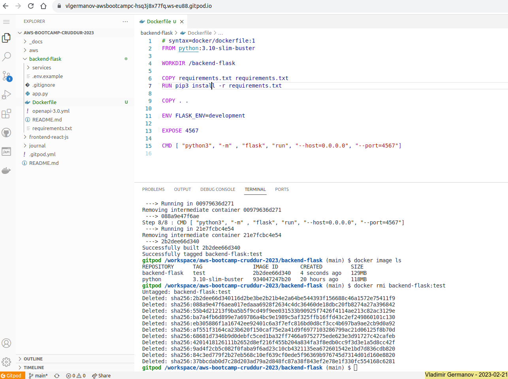
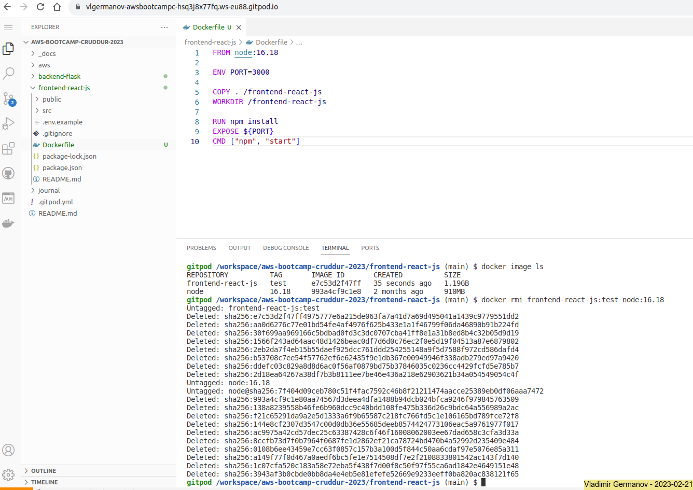
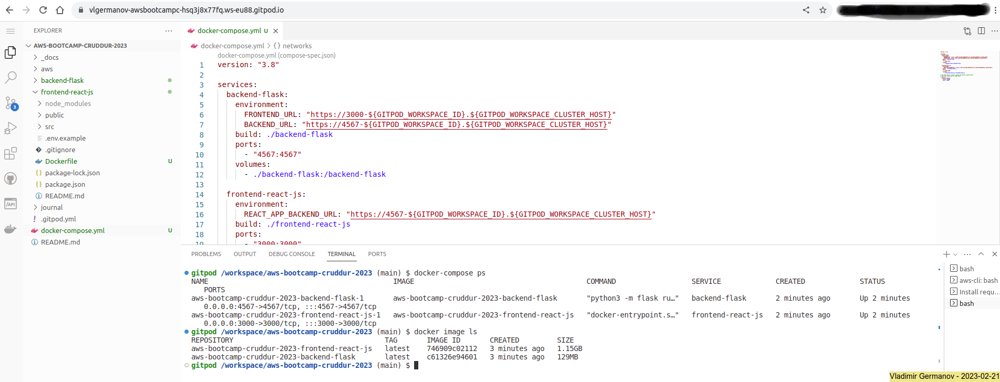
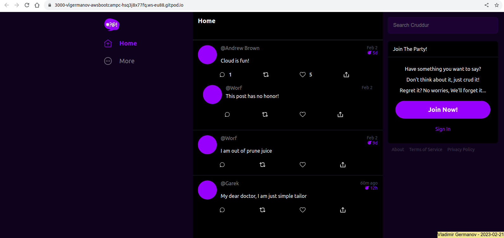
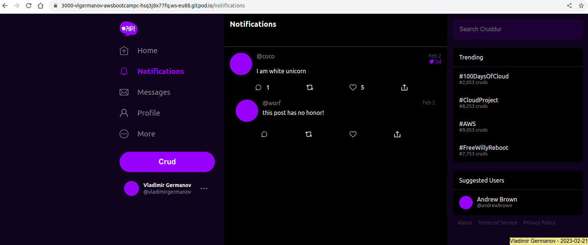
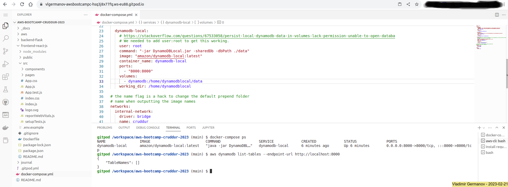
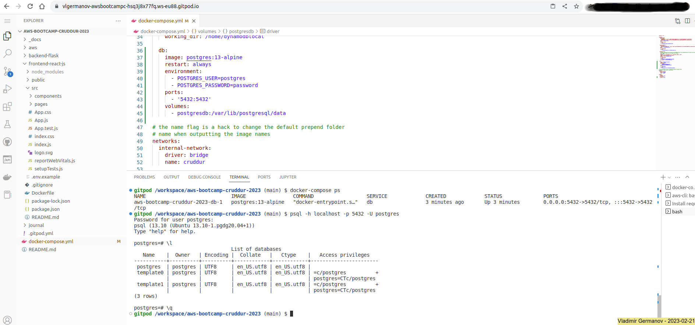

# Week 1 — App Containerization

## 1. Required Homework

### 1.1. Review of the week's videos

- [x] Watched: [How to Ask for Technical Help](https://www.youtube.com/watch?v=tDPqmwKMP7Y&list=PLBfufR7vyJJ7k25byhRXJldB5AiwgNnWv&index=29)
- [x] Watched: [Grading Homework Summaries](https://www.youtube.com/watch?v=FKAScachFgk&list=PLBfufR7vyJJ7k25byhRXJldB5AiwgNnWv&index=25)
- [x] Watched: [Week 1 - Live Streamed Video](https://www.youtube.com/watch?v=zJnNe5Nv4tE&list=PLBfufR7vyJJ7k25byhRXJldB5AiwgNnWv&index=22)
- [x] Watched: [Remember to Commit Your Code](https://www.youtube.com/watch?v=b-idMgFFcpg&list=PLBfufR7vyJJ7k25byhRXJldB5AiwgNnWv&index=23)
- [x] Watched: [Chirag's Week 1 - Spending Considerations](https://www.youtube.com/watch?v=OAMHu1NiYoI&list=PLBfufR7vyJJ7k25byhRXJldB5AiwgNnWv&index=24)
- [x] Watched: [Ashish's Week 1 - Container Security Considerations](https://www.youtube.com/watch?v=OjZz4D0B-cA&list=PLBfufR7vyJJ7k25byhRXJldB5AiwgNnWv&index=25)
- [x] Watched: [Containerize Application (Dockerfiles, Docker Compose)](https://www.youtube.com/watch?v=zJnNe5Nv4tE&list=PLBfufR7vyJJ7k25byhRXJldB5AiwgNnWv&index=22)
- [x] Watched: [Document the Notification Endpoint for the OpenAI Document](https://www.youtube.com/watch?v=k-_o0cCpksk&list=PLBfufR7vyJJ7k25byhRXJldB5AiwgNnWv&index=27)
> **Note:**
> [OpenAPI Specification v3.1.0](https://spec.openapis.org/oas/v3.1.0)
- [x] Watched: [Write a Flask Backend Endpoint for Notifications](https://www.youtube.com/watch?v=k-_o0cCpksk&list=PLBfufR7vyJJ7k25byhRXJldB5AiwgNnWv&index=27)
- [x] Watched: [Write a React Page for Notifications](https://www.youtube.com/watch?v=k-_o0cCpksk&list=PLBfufR7vyJJ7k25byhRXJldB5AiwgNnWv&index=27) 
> **Note:**
> Registration's confirmation code `hardcoded` to '1234'
- [x] Watched: [Run DynamoDB Local Container and ensure it works](https://www.youtube.com/watch?v=CbQNMaa6zTg&list=PLBfufR7vyJJ7k25byhRXJldB5AiwgNnWv&index=28)
- [x] Watched: [Run Postgres Container and ensure it works](https://www.youtube.com/watch?v=CbQNMaa6zTg&list=PLBfufR7vyJJ7k25byhRXJldB5AiwgNnWv&index=28)

### 1.2. Containerize the applications

#### 1.2.1. Backend-flask

- Created a [Dockerfile](../backend-flask/Dockerfile)

```dockerfile
FROM python:3.10-slim-buster

WORKDIR /backend-flask

COPY requirements.txt requirements.txt
RUN pip3 install -r requirements.txt

COPY . .

ENV FLASK_ENV=development

EXPOSE 4567

CMD [ "python3", "-m" , "flask", "run", "--host=0.0.0.0", "--port=4567"]
```

- Test `docker build`

```shell
gitpod /workspace/aws-bootcamp-cruddur-2023/backend-flask (main) $ docker build -t backend-flask:test .
Sending build context to Docker daemon  33.79kB
Step 1/8 : FROM python:3.10-slim-buster
 ---> 934047247b20
Step 2/8 : WORKDIR /backend-flask
 ---> Running in db01081dadcc
Removing intermediate container db01081dadcc
 ---> 84c3ed779f2b
Step 3/8 : COPY requirements.txt requirements.txt
 ---> 420141812611
Step 4/8 : RUN pip3 install -r requirements.txt
 ---> Running in f644ece4d265
Collecting flask
  Downloading Flask-2.2.3-py3-none-any.whl (101 kB)
     ━━━━━━━━━━━━━━━━━━━━━━━━━━━━━━━━━━━━━━━ 101.8/101.8 kB 7.1 MB/s eta 0:00:00
Collecting flask-cors
  Downloading Flask_Cors-3.0.10-py2.py3-none-any.whl (14 kB)
Collecting Werkzeug>=2.2.2
  Downloading Werkzeug-2.2.3-py3-none-any.whl (233 kB)
     ━━━━━━━━━━━━━━━━━━━━━━━━━━━━━━━━━━━━━━ 233.6/233.6 kB 33.3 MB/s eta 0:00:00
Collecting Jinja2>=3.0
  Downloading Jinja2-3.1.2-py3-none-any.whl (133 kB)
     ━━━━━━━━━━━━━━━━━━━━━━━━━━━━━━━━━━━━━━ 133.1/133.1 kB 49.2 MB/s eta 0:00:00
Collecting click>=8.0
  Downloading click-8.1.3-py3-none-any.whl (96 kB)
     ━━━━━━━━━━━━━━━━━━━━━━━━━━━━━━━━━━━━━━━━ 96.6/96.6 kB 37.2 MB/s eta 0:00:00
Collecting itsdangerous>=2.0
  Downloading itsdangerous-2.1.2-py3-none-any.whl (15 kB)
Collecting Six
  Downloading six-1.16.0-py2.py3-none-any.whl (11 kB)
Collecting MarkupSafe>=2.0
  Downloading MarkupSafe-2.1.2-cp310-cp310-manylinux_2_17_x86_64.manylinux2014_x86_64.whl (25 kB)
Installing collected packages: Six, MarkupSafe, itsdangerous, click, Werkzeug, Jinja2, flask, flask-cors
Successfully installed Jinja2-3.1.2 MarkupSafe-2.1.2 Six-1.16.0 Werkzeug-2.2.3 click-8.1.3 flask-2.2.3 flask-cors-3.0.10 itsdangerous-2.1.2
WARNING: Running pip as the 'root' user can result in broken permissions and conflicting behaviour with the system package manager. It is recommended to use a virtual environment instead: https://pip.pypa.io/warnings/venv

[notice] A new release of pip available: 22.3.1 -> 23.0.1
[notice] To update, run: pip install --upgrade pip
Removing intermediate container f644ece4d265
 ---> af551f3164ca
Step 5/8 : COPY . .
 ---> ba7a4fb6d899
Step 6/8 : ENV FLASK_ENV=development
 ---> Running in 555d0da1d10f
Removing intermediate container 555d0da1d10f
 ---> 55b4d21213f9
Step 7/8 : EXPOSE 4567
 ---> Running in 00979636d271
Removing intermediate container 00979636d271
 ---> 088a9e47f6ae
Step 8/8 : CMD [ "python3", "-m" , "flask", "run", "--host=0.0.0.0", "--port=4567"]
 ---> Running in 21e7fcbc4e54
Removing intermediate container 21e7fcbc4e54
 ---> 2b2dee66d340
Successfully built 2b2dee66d340
Successfully tagged backend-flask:test
gitpod /workspace/aws-bootcamp-cruddur-2023/backend-flask (main) $ docker image ls
REPOSITORY      TAG                IMAGE ID       CREATED         SIZE
backend-flask   test               2b2dee66d340   4 seconds ago   129MB
python          3.10-slim-buster   934047247b20   20 hours ago    118MB
gitpod /workspace/aws-bootcamp-cruddur-2023/backend-flask (main) $ docker rmi backend-flask:test 
Untagged: backend-flask:test
Deleted: sha256:2b2dee66d340116d2be3be2b21b4e2a64be544393f156688c46a1572e75411f9
Deleted: sha256:088a9e47f6aea017edaaa6928f2634c4dc36460de18dbc20fb8274a27a396842
Deleted: sha256:55b4d21213f9ba5b5f9cd49f9ee031533b90925f7426f4114ae213c82ac3129e
Deleted: sha256:ba7a4fb6d899e7a69786a4bc9e1989c5af325ffb16ffd43c2ef249860101c130
Deleted: sha256:eb305886f1a16742ee92401c6a3f7efc816bd0d8cf3cc4b697ba9ae2cb9d0a92
Deleted: sha256:af551f3164ca23b620f150caf75e2a41d9f6977103286799ac21d06125f8b70d
Deleted: sha256:68681d7346b9d0debfc5ced1ba32ff7466a9752775ede623e3d91727c42cafeb
Deleted: sha256:4201418126111b2652d8ef216f455b204a834fa3f8edb0cc9f3d3e1a5d8cc42f
Deleted: sha256:9ad4f2cb5c082f0faba9f6ad23c10cb4321135ea672601542e1bd7d836cdb820
Deleted: sha256:84c3ed779f2b27eb568c10ef639cf0ede5f96369b976745d7314d01d160e8820
Deleted: sha256:37bbcdab0d7c28d203ad79a2d848fc87a38f843ef2e78e1f330fc554168c6281
```



#### 1.2.2. Frontend-react-js

- Created a [Dockerfile](../frontend-react-js/Dockerfile)

```dockerfile
FROM node:16.18

ENV PORT=3000

COPY . /frontend-react-js
WORKDIR /frontend-react-js

RUN npm install
EXPOSE ${PORT}
CMD ["npm", "start"]
```

- Test `docker build`

```shell
gitpod /workspace/aws-bootcamp-cruddur-2023/frontend-react-js (main) $ docker build -t frontend-react-js:test .
Sending build context to Docker daemon   1.51MB
Step 1/7 : FROM node:16.18
 ---> 993a4cf9c1e8
Step 2/7 : ENV PORT=3000
 ---> Running in 4476467b4b92
Removing intermediate container 4476467b4b92
 ---> 2d18ea64267a
Step 3/7 : COPY . /frontend-react-js
 ---> b53708c7ee54
Step 4/7 : WORKDIR /frontend-react-js
 ---> Running in 907e22a3354f
Removing intermediate container 907e22a3354f
 ---> 2eb2da7f4eb1
Step 5/7 : RUN npm install
 ---> Running in ced0c60237b9
npm WARN deprecated w3c-hr-time@1.0.2: Use your platform's native performance.now() and performance.timeOrigin.
npm WARN deprecated stable@0.1.8: Modern JS already guarantees Array#sort() is a stable sort, so this library is deprecated. See the compatibility table on MDN: https://developer.mozilla.org/en-US/docs/Web/JavaScript/Reference/Global_Objects/Array/sort#browser_compatibility
npm WARN deprecated svgo@1.3.2: This SVGO version is no longer supported. Upgrade to v2.x.x.

added 1471 packages, and audited 1472 packages in 17s

225 packages are looking for funding
  run `npm fund` for details

8 high severity vulnerabilities

To address issues that do not require attention, run:
  npm audit fix

To address all issues (including breaking changes), run:
  npm audit fix --force

Run `npm audit` for details.
npm notice 
npm notice New major version of npm available! 8.19.2 -> 9.5.1
npm notice Changelog: <https://github.com/npm/cli/releases/tag/v9.5.1>
npm notice Run `npm install -g npm@9.5.1` to update!
npm notice 
Removing intermediate container ced0c60237b9
 ---> 30f699aa9691
Step 6/7 : EXPOSE ${PORT}
 ---> Running in 734e975763e6
Removing intermediate container 734e975763e6
 ---> aa0d6276c77e
Step 7/7 : CMD ["npm", "start"]
 ---> Running in f10e94b815f9
Removing intermediate container f10e94b815f9
 ---> e7c53d2f47ff
Successfully built e7c53d2f47ff
Successfully tagged frontend-react-js:test
gitpod /workspace/aws-bootcamp-cruddur-2023/frontend-react-js (main) $ docker image ls
REPOSITORY          TAG       IMAGE ID       CREATED          SIZE
frontend-react-js   test      e7c53d2f47ff   35 seconds ago   1.19GB
node                16.18     993a4cf9c1e8   2 months ago     910MB
gitpod /workspace/aws-bootcamp-cruddur-2023/frontend-react-js (main) $ docker rmi frontend-react-js:test node:16.18 
Untagged: frontend-react-js:test
Deleted: sha256:e7c53d2f47ff4975777e6a215de063fa7a41d7a69d495041a1439c9779551dd2
Deleted: sha256:aa0d6276c77e01bd54fe4af4976f625b433e1a1f46799f06da46890b91b224fd
Deleted: sha256:30f699aa969166c5bdbad0fd3c3dc0707cba41ff8e1a31b8ed8b4c32b05d9d19
Deleted: sha256:1566f243ad64aac48d1426beac0df7d6d0c76ec2f0e5d19f04513a87e6879802
Deleted: sha256:2eb2da7f4eb15b55daef925dcc761ddd254255148a9f5d7588f972cd586dafd4
Deleted: sha256:b53708c7ee54f57762ef6e62435f9e1db367e00949946f338adb279ed97a9420
Deleted: sha256:ddefc03c829a8d8d6ac0f56af0879bd75b37846035c0236cc4429fcfd5e785b7
Deleted: sha256:2d18ea64267a38df7b3b8111ee7be46e436a218e62903621b34a054549054c4f
Untagged: node:16.18
Untagged: node@sha256:7f404d09ceb780c51f4fac7592c46b8f21211474aacce25389eb0df06aaa7472
Deleted: sha256:993a4cf9c1e80aa74567d3deea4dfa1488b94dcb024bfca9246f979845763509
Deleted: sha256:138a8239558b46fe6b960dcc9c40bdd108fe475b336d26c9bdc64a556989a2ac
Deleted: sha256:f21c65291da9a2e5d1333a6f9b65587c218fc766fd5c1e106165bd789fce72f8
Deleted: sha256:144e8cf2307d3547c00d0db36e55685deeb8574424773106eac5a9761977f017
Deleted: sha256:ac9975a42cd57dec25c63387428c6f46f16008062003ee67dad658c3cfa3d33a
Deleted: sha256:8ccfb73d7f0b7964f0687fe1d2862ef21ca78724bd470b4a52992d235409e484
Deleted: sha256:0108b6ee43459e7cc63f0857c157b3a100d5f844c50aa6cdaf97e5076e85a311
Deleted: sha256:a149f77f0d467a0aedf6bc5fe1e7514508df7e2f2108833801542ac143f7d140
Deleted: sha256:1c07cfa520c183a58e72eba5f438f7d00f8c50f97f55ca6ad1842e4649151e48
Deleted: sha256:3943af3b0cbde0bb8da4e4eb5e81efefe52669e9233eeff0ba820ac838121f65
```



#### 1.2.3. Docker-compose

- Created a [docker-compose.yml](../docker-compose.yml) file

```yaml
version: "3.8"

services:
  backend-flask:
    environment:
      FRONTEND_URL: "https://3000-${GITPOD_WORKSPACE_ID}.${GITPOD_WORKSPACE_CLUSTER_HOST}"
      BACKEND_URL: "https://4567-${GITPOD_WORKSPACE_ID}.${GITPOD_WORKSPACE_CLUSTER_HOST}"
    build: ./backend-flask
    ports:
      - "4567:4567"
    volumes:
      - ./backend-flask:/backend-flask

  frontend-react-js:
    environment:
      REACT_APP_BACKEND_URL: "https://4567-${GITPOD_WORKSPACE_ID}.${GITPOD_WORKSPACE_CLUSTER_HOST}"
    build: ./frontend-react-js
    ports:
      - "3000:3000"
    volumes:
      - ./frontend-react-js:/frontend-react-js

# the name flag is a hack to change the default prepend folder
# name when outputting the image names
networks: 
  internal-network:
    driver: bridge
    name: cruddur
```

- Tests




```shell
gitpod /workspace/aws-bootcamp-cruddur-2023 (main) $ curl -X GET https://4567-vlgermanov-awsbootcampc-hsq3j8x77fq.ws-eu88.gitpod.io/api/activities/home -H "Accept: application/json" -H "Content-Type: application/json"
[
  {
    "created_at": "2023-02-23T21:15:56.577144+00:00",
    "expires_at": "2023-03-02T21:15:56.577144+00:00",
    "handle": "Andrew Brown",
    "likes_count": 5,
    "message": "Cloud is fun!",
    "replies": [
      {
        "created_at": "2023-02-23T21:15:56.577144+00:00",
        "handle": "Worf",
        "likes_count": 0,
        "message": "This post has no honor!",
        "replies_count": 0,
        "reply_to_activity_uuid": "68f126b0-1ceb-4a33-88be-d90fa7109eee",
        "reposts_count": 0,
        "uuid": "26e12864-1c26-5c3a-9658-97a10f8fea67"
      }
    ],
    "replies_count": 1,
    "reposts_count": 0,
    "uuid": "68f126b0-1ceb-4a33-88be-d90fa7109eee"
  },
  {
    "created_at": "2023-02-18T21:15:56.577144+00:00",
    "expires_at": "2023-03-06T21:15:56.577144+00:00",
    "handle": "Worf",
    "likes": 0,
    "message": "I am out of prune juice",
    "replies": [],
    "uuid": "66e12864-8c26-4c3a-9658-95a10f8fea67"
  },
  {
    "created_at": "2023-02-25T20:15:56.577144+00:00",
    "expires_at": "2023-02-26T09:15:56.577144+00:00",
    "handle": "Garek",
    "likes": 0,
    "message": "My dear doctor, I am just simple tailor",
    "replies": [],
    "uuid": "248959df-3079-4947-b847-9e0892d1bab4"
  }
]
```

### 1.3. Notifications functionality in the applications

#### 1.3.1. Document the Notification Endpoint for the OpenAI Document

- Add the following to the `paths:` section in the [openapi-3.0.yml](../backend-flask/openapi-3.0.yml) file

```yaml
  /api/activities/notifications:
    get:
      description: 'Return a feed of activity for all of those that I follow'
      tags:
        - activities
      responses:
        '200':
          description: Returns an array of activities"
          content:
            application/json:
              schema:
                type: array
                items:
                  $ref: '#/components/schemas/Activity'
```

#### 1.3.2. Backend-flask notifications endpoint

- Created a [notifications_activities.py](../backend-flask/services/notifications_activities.py) file
- Modified the [app.py](../backend-flask/app.py) file

Add a new import:

```python
from services.notifications_activities import *
```

Add a new route:

```python
@app.route("/api/activities/notifications", methods=['GET'])
def data_notifications():
  data = NotificationsActivities.run()
  return data, 200
```

#### 1.3.3. Frontend-react-js notifications endpoint

- Created a [NotificationsFeedPage.css](../frontend-react-js/src/pages/NotificationsFeedPage.css) file
- Created a [NotificationsFeedPage.js](../frontend-react-js/src/pages/NotificationsFeedPage.js) file
- Modified the [App.js](../frontend-react-js/src/App.js) file

Add a new import:

```js
import NotificationsFeedPage from './pages/NotificationsFeedPage';
```

Add a new route:

```js
  {
    path: "/notifications",
    element: <NotificationsFeedPage />
  },
```

#### 1.3.4. Testing notifications endpoint



### 1.4. Run locally DB containers

#### 1.4.1. DynamoDB Local Container

- Modify the [docker-compose.yml](../docker-compose.yml) file to add the following service section

```yaml
services:
  dynamodb-local:
    # https://stackoverflow.com/questions/67533058/persist-local-dynamodb-data-in-volumes-lack-permission-unable-to-open-databa
    # We needed to add user:root to get this working.
    user: root
    command: "-jar DynamoDBLocal.jar -sharedDb -dbPath ./data"
    image: "amazon/dynamodb-local:latest"
    container_name: dynamodb-local
    ports:
      - "8000:8000"
    volumes:
      - "./docker/dynamodb:/home/dynamodblocal/data"
    working_dir: /home/dynamodblocal
```

- Modify the [docker-compose.yml](../docker-compose.yml) file to add the following volume section

```yaml
volumes:
  dynamodb:
    driver: local
```

> **Note:**
> I used named volume for the dynamodb local container - with this approach it is not needed to
> exclude `./docker/dynamodb` directory with `.gitignore` file

- Testing connectivity to DynamoDB Local container

```shell
gitpod /workspace/aws-bootcamp-cruddur-2023 (main) $ docker-compose ps
NAME                IMAGE                          COMMAND                  SERVICE             CREATED             STATUS              PORTS
dynamodb-local      amazon/dynamodb-local:latest   "java -jar DynamoDBL…"   dynamodb-local      6 minutes ago       Up 6 minutes        0.0.0.0:8000->8000/tcp, :::8000->8000/tcp
gitpod /workspace/aws-bootcamp-cruddur-2023 (main) $ aws dynamodb list-tables --endpoint-url http://localhost:8000
{
    "TableNames": []
}
```



#### 1.4.2. Postgres Container

- Modify the [docker-compose.yml](../docker-compose.yml) file to add the following service section

```yaml
services:
  db:
    image: postgres:13-alpine
    restart: always
    environment:
      - POSTGRES_USER=postgres
      - POSTGRES_PASSWORD=password
    ports:
      - '5432:5432'
    volumes:
      - postgresdb:/var/lib/postgresql/data
```

- Modify the [docker-compose.yml](../docker-compose.yml) file to add the following volume section

```yaml
volumes:
  postgresdb:
    driver: local
```

- Testing connectivity to Postgres container

```shell
gitpod /workspace/aws-bootcamp-cruddur-2023 (main) $ docker-compose ps
NAME                             IMAGE                COMMAND                  SERVICE             CREATED             STATUS              PORTS
aws-bootcamp-cruddur-2023-db-1   postgres:13-alpine   "docker-entrypoint.s…"   db                  3 minutes ago       Up 3 minutes        0.0.0.0:5432->5432/tcp, :::5432->5432/tcp
gitpod /workspace/aws-bootcamp-cruddur-2023 (main) $ psql -h localhost -p 5432 -U postgres
Password for user postgres: 
psql (13.10 (Ubuntu 13.10-1.pgdg20.04+1))
Type "help" for help.

postgres=# \l
                                 List of databases
   Name    |  Owner   | Encoding |  Collate   |   Ctype    |   Access privileges   
-----------+----------+----------+------------+------------+-----------------------
 postgres  | postgres | UTF8     | en_US.utf8 | en_US.utf8 | 
 template0 | postgres | UTF8     | en_US.utf8 | en_US.utf8 | =c/postgres          +
           |          |          |            |            | postgres=CTc/postgres
 template1 | postgres | UTF8     | en_US.utf8 | en_US.utf8 | =c/postgres          +
           |          |          |            |            | postgres=CTc/postgres
(3 rows)

postgres=# \q
```



## 2. Stretched Homework

### 2.1. Research best practices of `Dockerfile(s)`

- Create a `.dockerignore` file to exclude files not relevant to the build of the container image

Example:

```text
**/.git
**/.gitignore
**/.dockerignore
**/.vscode
**/coverage
**/.env
**/.aws
**/.ssh
Dockerfile*
README.md
docker-compose.yml
**/.DS_Store
**/venv
**/env
```

- Add a `LABEL` instruction(s) in the `Dockerfile`

Example:

```dockerfile
# Set one or more individual labels
LABEL com.example.version="0.0.1-beta"
LABEL vendor1="ACME Incorporated"
LABEL com.example.release-date="2023-02-24"
LABEL com.example.version.is-production=""
```

- Use explicit and deterministic Docker base image tags
  - Choose the minimum base image that meets all your requirements, and then build on top of that. Smaller images contain fewer vulnerabilities, are less resource intensive, and have fewer unnecessary packages
  - Using the named tag isn’t enough to ensure that you will always use the same base image. The only way of ensuring this is by using the image digest

How to find the `digest` of a container image?

```shell
$ docker images --digests 
REPOSITORY          TAG                   DIGEST                                                                    IMAGE ID       CREATED        SIZE
python              3.10-slim-buster      sha256:c059afb019e7aea99777e54b3e0ff8c970ef552b737fb4acbd842916c751fcfd   934047247b20   25 hours ago   118MB
python              3.10.10-slim-buster   sha256:c059afb019e7aea99777e54b3e0ff8c970ef552b737fb4acbd842916c751fcfd   934047247b20   25 hours ago   118MB
```

Example:

```dockerfile
FROM python:3.10-slim-buster@sha256:c059afb019e7aea99777e54b3e0ff8c970ef552b737fb4acbd842916c751fcfd
```

- Use multi-stage builds

Multi-stage building means that we use a Docker image with more tools for compiling those required dependencies, and afterwards we just copy the artifacts needed to the actual Docker image that gets used. Multi-stage builds are a great way to move from a simple, yet potentially erroneous `Dockerfile`, into separated steps of building a Docker image, so we can avoid leaking sensitive information. Not only that, but we can also use a bigger Docker base image to install our dependencies, compile any native packages if needed, and then copy all these artifacts into a small production base image.

Example:

```dockerfile
FROM node:latest AS build
ARG NPM_TOKEN
WORKDIR /usr/src/app
COPY package*.json /usr/src/app/
RUN npm install


FROM node:lts-alpine@sha256:b2da3316acdc2bec442190a1fe10dc094e7ba4121d029cb32075ff59bb27390a
WORKDIR /usr/src/app
COPY --from=build /usr/src/app/node_modules /usr/src/app/node_modules
COPY . .
CMD ["node", "server.js"]
```

- Don't run containers as `root` user

The principle of least privilege is a security principle from the early days of Unix and we should always follow this when we’re running our containerized applications.

The threat assessment is pretty straight-forward, if an attacker is able to compromise the application in a way that allows for command injection or directory path traversal, then these will be invoked with the user who owns the application process. If that process happens to be `root` then they can do virtually everything within the container, including attempting a container escape or privilege escalation.

Example:

```dockerfile
FROM node:16.17.0-bullseye-slim
ENV NODE_ENV production
WORKDIR /usr/src/app
COPY --chown=node:node . /usr/src/app
RUN npm ci --only=production
USER node
CMD "npm" "start"
```

- Find and fix security vulnerabilities in your container images

Use tools like `snyk`, `clair` or `trivy` to scan the container images and detect vulnerabilities.

- Optimize for Production usage

Based on the technology used to build the application, there can be different tools/methods to optimize the container
image for production usage

Example(s) for python flask:

1. Disable any debug flags

```python
app.run(debug=False)
```

2. Disable any development/testing flags

```dockerfile
ENV FLASK_ENV=development
ENV PYTHONDONTWRITEBYTECODE 1
ENV PYTHONUNBUFFERED 1
```

3. Use Python WSGI for production

- `gunicorn`
- `uWSGI`
- `CherryPy`
- `mod_wsgi`

Example(s) for node js:

1. Install only production dependencies in the Node.js Docker image

```dockerfile
RUN npm ci --only=production
```

2. Optimize Node.js tooling for production

```dockerfile
ENV NODE_ENV production
```

### 2.2. Implement best practices of `Dockerfile(s)` in CRUDDUR application (based on the research done in section 2.1)

#### 2.2.1. Backend-flask

- Created a [Dockerfile.prod](../backend-flask/Dockerfile.prod)

```dockerfile
FROM python:3.10-slim-buster as build

ENV PYTHONDONTWRITEBYTECODE 1
ENV PYTHONUNBUFFERED 1

RUN apt-get update && apt-get install -y --no-install-recommends \
build-essential gcc

WORKDIR /usr/app
RUN python -m venv /usr/app/venv
ENV PATH="/usr/app/venv/bin:$PATH"

COPY requirements.txt .
RUN pip install -U pip setuptools && pip install -r requirements.txt


FROM python:3.10-slim-buster@sha256:c059afb019e7aea99777e54b3e0ff8c970ef552b737fb4acbd842916c751fcfd

RUN groupadd -g 999 -r app && \
    useradd -M -s /bin/false -r -u 999 -g app app

RUN mkdir /usr/app && chown app:app /usr/app
WORKDIR /usr/app

COPY --chown=app:app --from=build /usr/app/venv ./venv

COPY --chown=app:app . .

EXPOSE 4567

USER 999

ENV PATH="/usr/app/venv/bin:$PATH"

#CMD [ "python3", "-m" , "flask", "run", "--host=0.0.0.0", "--port=4567"]
ENTRYPOINT ["gunicorn"]
CMD [ "--bind", "0.0.0.0:4567", "app:app" ]
```

- Created a [.dockerignore](../backend-flask/.dockerignore) file

```text
**/.git
**/.gitignore
**/.dockerignore
**/.vscode
**/coverage
**/.env
**/.aws
**/.ssh
Dockerfile*
README.md
docker-compose*.yml
**/.DS_Store
**/venv
**/env
__pycache__/
```

- Modified the [app.py](../backend-flask/app.py) file

Add a new line:

```python
debug = os.getenv('DEBUG_APP', False)
```

Modify:

```python
  app.run(debug=debug)
```

- Modify the [docker-compose.yml](../docker-compose.yml) file

Add extra environment variable to backend-flash service:

```yaml
  backend-flask:
    environment:
      FRONTEND_URL: "https://3000-${GITPOD_WORKSPACE_ID}.${GITPOD_WORKSPACE_CLUSTER_HOST}"
      BACKEND_URL: "https://4567-${GITPOD_WORKSPACE_ID}.${GITPOD_WORKSPACE_CLUSTER_HOST}"
      DEBUG_APP: True
    build: ./backend-flask
    ports:
      - "4567:4567"
    volumes:
      - ./backend-flask:/backend-flask
```

#### 2.2.2. Frontend-react-js

### 2.3. Build and publish container's images to DockerHub

### 2.4. Implement a `health check` in the docker-compose file

### 2.5. Install docker on my local machine and run the applications locally

### 2.6. Launch an EC2 instance with docker installed and lunch the apps there
